# Stage-1 Database Schema

## 🗄️ **ENTITY RELATIONSHIP DIAGRAM**

```mermaid
erDiagram
    USERS {
        BIGSERIAL id PK
        VARCHAR name
        VARCHAR email UK
        VARCHAR password
        VARCHAR role
        BOOLEAN enabled
        TIMESTAMP created_at
        TIMESTAMP updated_at
    }
    
    REFRESH_TOKENS {
        BIGSERIAL id PK
        BIGINT user_id FK
        VARCHAR token_hash
        TIMESTAMP expires_at
        TIMESTAMP revoked_at
        TIMESTAMP created_at
    }
    
    STUDENT_PROFILES {
        BIGSERIAL id PK
        BIGINT user_id FK,UK
        VARCHAR first_name
        VARCHAR middle_name
        VARCHAR last_name
        VARCHAR mother_name
        VARCHAR father_name
        VARCHAR guardian_name
        VARCHAR parent_name
        VARCHAR mobile_number
        VARCHAR alternate_mobile_number
        DATE date_of_birth
        VARCHAR educational_board
        VARCHAR class_level
        VARCHAR grade_level
        VARCHAR school_name
        VARCHAR emergency_contact
        VARCHAR student_photo_url
        VARCHAR school_id_card_url
        TIMESTAMP created_at
        TIMESTAMP updated_at
    }
    
    STUDENT_DOCUMENTS {
        BIGSERIAL id PK
        BIGINT student_id FK
        VARCHAR document_name
        VARCHAR document_url
        VARCHAR document_type
        TIMESTAMP upload_date
        TIMESTAMP created_at
        TIMESTAMP updated_at
    }
    
    TEACHERS {
        BIGSERIAL id PK
        BIGINT user_id FK,UK
        VARCHAR name
        VARCHAR email
        VARCHAR phone_number
        VARCHAR alternate_phone_number
        DATE date_of_birth
        VARCHAR gender
        VARCHAR profile_picture_url
        VARCHAR linkedin_profile
        TEXT bio
        VARCHAR status
        TIMESTAMP created_at
        TIMESTAMP updated_at
    }
    
    TEACHER_PROFILES {
        BIGSERIAL id PK
        BIGINT user_id FK,UK
        BIGINT teacher_id FK,UK
        TEXT bio
        TEXT qualifications
        DECIMAL hourly_rate
        INTEGER years_of_experience
        VARCHAR specialization
        BOOLEAN verified
        VARCHAR first_name
        VARCHAR middle_name
        VARCHAR last_name
        VARCHAR mobile_number
        VARCHAR alternate_mobile_number
        VARCHAR contact_email
        VARCHAR highest_education
        VARCHAR postal_address
        VARCHAR city
        VARCHAR state
        VARCHAR country
        VARCHAR secondary_address
        VARCHAR profile_photo_url
        VARCHAR govt_id_proof_url
        DECIMAL rating
        INTEGER total_reviews
        TIMESTAMP created_at
        TIMESTAMP updated_at
    }
    
    TEACHER_PROFESSIONAL_INFO {
        BIGSERIAL id PK
        BIGINT teacher_id FK,UK
        VARCHAR specialization
        INTEGER years_of_experience
        DECIMAL hourly_rate
        VARCHAR current_institution
        VARCHAR designation
        TEXT subjects_expertise
        TIMESTAMP created_at
        TIMESTAMP updated_at
    }
    
    TEACHER_QUALIFICATIONS {
        BIGSERIAL id PK
        BIGINT teacher_id FK
        VARCHAR degree
        VARCHAR specialization
        VARCHAR university
        INTEGER year
        TIMESTAMP created_at
        TIMESTAMP updated_at
    }
    
    TEACHER_EXPERIENCES {
        BIGSERIAL id PK
        BIGINT teacher_id FK
        VARCHAR institution
        VARCHAR role
        TEXT subjects_taught
        DATE from_date
        DATE to_date
        BOOLEAN currently_working
        TIMESTAMP created_at
        TIMESTAMP updated_at
    }
    
    TEACHER_CERTIFICATIONS {
        BIGSERIAL id PK
        BIGINT teacher_id FK
        VARCHAR certification_name
        VARCHAR issuing_authority
        VARCHAR certification_id
        INTEGER issue_year
        DATE expiry_date
        TIMESTAMP created_at
        TIMESTAMP updated_at
    }
    
    TEACHER_AVAILABILITY {
        BIGSERIAL id PK
        BIGINT teacher_id FK,UK
        TIME available_from
        TIME available_to
        JSONB preferred_student_levels
        JSONB languages_spoken
        TIMESTAMP created_at
        TIMESTAMP updated_at
    }
    
    TEACHER_DOCUMENTS {
        BIGSERIAL id PK
        BIGINT teacher_id FK
        VARCHAR document_name
        VARCHAR document_url
        VARCHAR document_type
        TIMESTAMP upload_date
        TIMESTAMP created_at
        TIMESTAMP updated_at
    }
    
    TEACHER_BANK_DETAILS {
        BIGSERIAL id PK
        BIGINT teacher_id FK,UK
        VARCHAR pan_number
        VARCHAR account_holder_name
        VARCHAR bank_name
        VARCHAR account_number "ENCRYPTED"
        VARCHAR ifsc_code
        VARCHAR account_type
        TEXT branch_address
        VARCHAR micr_code
        VARCHAR mobile_number
        VARCHAR email
        BOOLEAN terms_accepted
        BOOLEAN verified
        TIMESTAMP created_at
        TIMESTAMP updated_at
    }
    
    TEACHER_ADDRESSES {
        BIGSERIAL id PK
        BIGINT teacher_id FK
        VARCHAR address_line1
        VARCHAR address_line2
        VARCHAR city
        VARCHAR state
        VARCHAR zip_code
        VARCHAR country
        VARCHAR address_type
        TIMESTAMP created_at
        TIMESTAMP updated_at
    }
    
    ADMIN_PROFILES {
        BIGSERIAL id PK
        BIGINT user_id FK,UK
        VARCHAR phone_number
        BOOLEAN is_super_admin
        TIMESTAMP last_login
        TIMESTAMP created_at
        TIMESTAMP updated_at
    }
    
    %% Relationships
    USERS ||--o{ REFRESH_TOKENS : "has"
    USERS ||--o| STUDENT_PROFILES : "has"
    USERS ||--o| TEACHERS : "has"
    USERS ||--o| TEACHER_PROFILES : "has"
    USERS ||--o| ADMIN_PROFILES : "has"
    
    STUDENT_PROFILES ||--o{ STUDENT_DOCUMENTS : "has"
    
    TEACHERS ||--o| TEACHER_PROFILES : "has"
    TEACHERS ||--o| TEACHER_PROFESSIONAL_INFO : "has"
    TEACHERS ||--o{ TEACHER_QUALIFICATIONS : "has"
    TEACHERS ||--o{ TEACHER_EXPERIENCES : "has"
    TEACHERS ||--o{ TEACHER_CERTIFICATIONS : "has"
    TEACHERS ||--o| TEACHER_AVAILABILITY : "has"
    TEACHERS ||--o{ TEACHER_DOCUMENTS : "has"
    TEACHERS ||--o| TEACHER_BANK_DETAILS : "has"
    TEACHERS ||--o{ TEACHER_ADDRESSES : "has"
```



## 📊 **TABLE DETAILS**

### **Core Tables**

#### **users**
**Purpose**: Central user authentication and role management

| Column | Type | Constraints | Description |
|--------|------|-------------|-------------|
| `id` | `BIGSERIAL` | `PRIMARY KEY` | Auto-incrementing user ID |
| `name` | `VARCHAR(100)` | `NOT NULL` | User's full name |
| `email` | `VARCHAR(150)` | `NOT NULL, UNIQUE` | Email address (login credential) |
| `password` | `VARCHAR(255)` | `NOT NULL` | BCrypt hashed password |
| `role` | `VARCHAR(16)` | `NOT NULL, CHECK` | User role: `STUDENT`, `TEACHER`, `ADMIN` |
| `enabled` | `BOOLEAN` | `NOT NULL, DEFAULT TRUE` | Account status |
| `created_at` | `TIMESTAMP` | `NOT NULL, DEFAULT NOW()` | Account creation time |
| `updated_at` | `TIMESTAMP` | `NOT NULL, DEFAULT NOW()` | Last update time |

**Indexes**:
- `idx_users_role` on `role`
- `idx_users_email` on `email`

#### **refresh_tokens**
**Purpose**: JWT refresh token management

| Column | Type | Constraints | Description |
|--------|------|-------------|-------------|
| `id` | `BIGSERIAL` | `PRIMARY KEY` | Token ID |
| `user_id` | `BIGINT` | `NOT NULL, FK` | References `users(id)` |
| `token_hash` | `VARCHAR(255)` | `NOT NULL` | Hashed refresh token |
| `expires_at` | `TIMESTAMP` | `NOT NULL` | Token expiration time |
| `revoked_at` | `TIMESTAMP` | `NULL` | Token revocation time |
| `created_at` | `TIMESTAMP` | `NOT NULL, DEFAULT NOW()` | Token creation time |

**Foreign Keys**:
- `user_id` → `users(id)` `ON DELETE CASCADE`

**Indexes**:
- `idx_refresh_user` on `user_id`
- `idx_refresh_token_hash` on `token_hash`

### **Student Tables**

#### **student_profiles**
**Purpose**: Student personal and academic information

| Column | Type | Constraints | Description |
|--------|------|-------------|-------------|
| `id` | `BIGSERIAL` | `PRIMARY KEY` | Profile ID |
| `user_id` | `BIGINT` | `NOT NULL, UNIQUE, FK` | References `users(id)` |
| `first_name` | `VARCHAR(100)` | `NOT NULL` | Student's first name |
| `middle_name` | `VARCHAR(100)` | `NULL` | Student's middle name |
| `last_name` | `VARCHAR(100)` | `NOT NULL` | Student's last name |
| `mother_name` | `VARCHAR(100)` | `NULL` | Mother's name |
| `father_name` | `VARCHAR(100)` | `NULL` | Father's name |
| `guardian_name` | `VARCHAR(100)` | `NULL` | Guardian's name |
| `parent_name` | `VARCHAR(100)` | `NULL` | Parent's name |
| `mobile_number` | `VARCHAR(20)` | `NULL` | Primary mobile number |
| `alternate_mobile_number` | `VARCHAR(20)` | `NULL` | Secondary mobile number |
| `date_of_birth` | `DATE` | `NULL` | Student's birth date |
| `educational_board` | `VARCHAR(20)` | `CHECK` | Board: `CBSE`, `ICSE`, `STATE_BOARD`, `IB`, `CAMBRIDGE`, `OTHER` |
| `class_level` | `VARCHAR(16)` | `NULL` | Grade level: `GRADE_7` to `GRADE_12` |
| `grade_level` | `VARCHAR(20)` | `NULL` | Alternative grade representation |
| `school_name` | `VARCHAR(200)` | `NULL` | School name |
| `emergency_contact` | `VARCHAR(100)` | `NULL` | Emergency contact information |
| `student_photo_url` | `VARCHAR(500)` | `NULL` | Profile photo URL |
| `school_id_card_url` | `VARCHAR(500)` | `NULL` | School ID card URL |

**Foreign Keys**:
- `user_id` → `users(id)` `ON DELETE CASCADE`

#### **student_documents**
**Purpose**: Student document management

| Column | Type | Constraints | Description |
|--------|------|-------------|-------------|
| `id` | `BIGSERIAL` | `PRIMARY KEY` | Document ID |
| `student_id` | `BIGINT` | `NOT NULL, FK` | References `student_profiles(id)` |
| `document_name` | `VARCHAR(100)` | `NOT NULL` | Document name/title |
| `document_url` | `VARCHAR(500)` | `NOT NULL` | Document URL |
| `document_type` | `VARCHAR(50)` | `NULL` | Document category |
| `upload_date` | `TIMESTAMP` | `NOT NULL, DEFAULT NOW()` | Upload timestamp |

**Foreign Keys**:
- `student_id` → `student_profiles(id)` `ON DELETE CASCADE`

**Indexes**:
- `idx_student_docs_sid` on `student_id`

### **Teacher Tables**

#### **teachers**
**Purpose**: Core teacher information

| Column | Type | Constraints | Description |
|--------|------|-------------|-------------|
| `id` | `BIGSERIAL` | `PRIMARY KEY` | Teacher ID |
| `user_id` | `BIGINT` | `NOT NULL, UNIQUE, FK` | References `users(id)` |
| `name` | `VARCHAR(255)` | `NOT NULL` | Teacher's full name |
| `email` | `VARCHAR(255)` | `NOT NULL` | Contact email |
| `phone_number` | `VARCHAR(20)` | `NULL` | Primary phone |
| `alternate_phone_number` | `VARCHAR(20)` | `NULL` | Secondary phone |
| `date_of_birth` | `DATE` | `NULL` | Birth date |
| `gender` | `VARCHAR(10)` | `CHECK` | Gender: `MALE`, `FEMALE`, `OTHER` |
| `profile_picture_url` | `VARCHAR(500)` | `NULL` | Profile picture URL |
| `linkedin_profile` | `VARCHAR(255)` | `NULL` | LinkedIn profile URL |
| `bio` | `TEXT` | `NULL` | Biography/description |
| `status` | `VARCHAR(16)` | `NOT NULL, DEFAULT 'PENDING', CHECK` | Status: `PENDING`, `ACTIVE`, `INACTIVE`, `SUSPENDED` |

**Foreign Keys**:
- `user_id` → `users(id)` `ON DELETE CASCADE`

#### **teacher_profiles**
**Purpose**: Extended teacher profile information

| Column | Type | Constraints | Description |
|--------|------|-------------|-------------|
| `id` | `BIGSERIAL` | `PRIMARY KEY` | Profile ID |
| `user_id` | `BIGINT` | `NOT NULL, UNIQUE, FK` | References `users(id)` |
| `teacher_id` | `BIGINT` | `NOT NULL, UNIQUE, FK` | References `teachers(id)` |
| `bio` | `TEXT` | `NULL` | Detailed biography |
| `qualifications` | `TEXT` | `NULL` | Qualification summary |
| `hourly_rate` | `DECIMAL(8,2)` | `NULL` | Teaching rate per hour |
| `years_of_experience` | `INTEGER` | `NULL` | Years of teaching experience |
| `specialization` | `VARCHAR(255)` | `NULL` | Subject specialization |
| `verified` | `BOOLEAN` | `DEFAULT FALSE` | Profile verification status |
| `rating` | `DECIMAL(3,2)` | `DEFAULT 0.0` | Average rating |
| `total_reviews` | `INTEGER` | `DEFAULT 0` | Number of reviews |

**Foreign Keys**:
- `user_id` → `users(id)` `ON DELETE CASCADE`
- `teacher_id` → `teachers(id)` `ON DELETE CASCADE`

#### **teacher_professional_info**
**Purpose**: Professional details and current position

| Column | Type | Constraints | Description |
|--------|------|-------------|-------------|
| `id` | `BIGSERIAL` | `PRIMARY KEY` | Info ID |
| `teacher_id` | `BIGINT` | `NOT NULL, UNIQUE, FK` | References `teachers(id)` |
| `specialization` | `VARCHAR(255)` | `NULL` | Teaching specialization |
| `years_of_experience` | `INTEGER` | `NULL` | Total experience |
| `hourly_rate` | `DECIMAL(8,2)` | `NULL` | Current hourly rate |
| `current_institution` | `VARCHAR(255)` | `NULL` | Current workplace |
| `designation` | `VARCHAR(255)` | `NULL` | Current position |
| `subjects_expertise` | `TEXT` | `NULL` | Subject expertise details |

**Foreign Keys**:
- `teacher_id` → `teachers(id)` `ON DELETE CASCADE`

#### **teacher_qualifications**
**Purpose**: Educational qualifications

| Column | Type | Constraints | Description |
|--------|------|-------------|-------------|
| `id` | `BIGSERIAL` | `PRIMARY KEY` | Qualification ID |
| `teacher_id` | `BIGINT` | `NOT NULL, FK` | References `teachers(id)` |
| `degree` | `VARCHAR(255)` | `NULL` | Degree name |
| `specialization` | `VARCHAR(255)` | `NULL` | Field of study |
| `university` | `VARCHAR(255)` | `NULL` | University/institution |
| `year` | `INTEGER` | `NULL` | Graduation year |

**Foreign Keys**:
- `teacher_id` → `teachers(id)` `ON DELETE CASCADE`

**Indexes**:
- `idx_tqual_tid` on `teacher_id`

#### **teacher_experiences**
**Purpose**: Work experience history

| Column | Type | Constraints | Description |
|--------|------|-------------|-------------|
| `id` | `BIGSERIAL` | `PRIMARY KEY` | Experience ID |
| `teacher_id` | `BIGINT` | `NOT NULL, FK` | References `teachers(id)` |
| `institution` | `VARCHAR(255)` | `NULL` | Workplace name |
| `role` | `VARCHAR(255)` | `NULL` | Position held |
| `subjects_taught` | `TEXT` | `NULL` | Subjects taught |
| `from_date` | `DATE` | `NULL` | Start date |
| `to_date` | `DATE` | `NULL` | End date |
| `currently_working` | `BOOLEAN` | `DEFAULT FALSE` | Still employed |

**Foreign Keys**:
- `teacher_id` → `teachers(id)` `ON DELETE CASCADE`

**Indexes**:
- `idx_texp_tid` on `teacher_id`

#### **teacher_certifications**
**Purpose**: Professional certifications

| Column | Type | Constraints | Description |
|--------|------|-------------|-------------|
| `id` | `BIGSERIAL` | `PRIMARY KEY` | Certification ID |
| `teacher_id` | `BIGINT` | `NOT NULL, FK` | References `teachers(id)` |
| `certification_name` | `VARCHAR(255)` | `NULL` | Certification title |
| `issuing_authority` | `VARCHAR(255)` | `NULL` | Issuing organization |
| `certification_id` | `VARCHAR(100)` | `NULL` | Certification number |
| `issue_year` | `INTEGER` | `NULL` | Year issued |
| `expiry_date` | `DATE` | `NULL` | Expiration date |

**Foreign Keys**:
- `teacher_id` → `teachers(id)` `ON DELETE CASCADE`

**Indexes**:
- `idx_tcert_tid` on `teacher_id`

#### **teacher_availability**
**Purpose**: Teaching availability and preferences

| Column | Type | Constraints | Description |
|--------|------|-------------|-------------|
| `id` | `BIGSERIAL` | `PRIMARY KEY` | Availability ID |
| `teacher_id` | `BIGINT` | `NOT NULL, UNIQUE, FK` | References `teachers(id)` |
| `available_from` | `TIME` | `NULL` | Start time |
| `available_to` | `TIME` | `NULL` | End time |
| `preferred_student_levels` | `JSONB` | `NULL` | Preferred grade levels |
| `languages_spoken` | `JSONB` | `NULL` | Languages supported |

**Foreign Keys**:
- `teacher_id` → `teachers(id)` `ON DELETE CASCADE`

#### **teacher_documents**
**Purpose**: Teacher document management

| Column | Type | Constraints | Description |
|--------|------|-------------|-------------|
| `id` | `BIGSERIAL` | `PRIMARY KEY` | Document ID |
| `teacher_id` | `BIGINT` | `NOT NULL, FK` | References `teachers(id)` |
| `document_name` | `VARCHAR(255)` | `NULL` | Document name |
| `document_url` | `VARCHAR(500)` | `NOT NULL` | Document URL |
| `document_type` | `VARCHAR(50)` | `NULL` | Document category |
| `upload_date` | `TIMESTAMP` | `NOT NULL, DEFAULT NOW()` | Upload timestamp |

**Foreign Keys**:
- `teacher_id` → `teachers(id)` `ON DELETE CASCADE`

**Indexes**:
- `idx_tdocs_tid` on `teacher_id`

#### **teacher_bank_details** 🔒
**Purpose**: Encrypted bank account information

| Column | Type | Constraints | Description |
|--------|------|-------------|-------------|
| `id` | `BIGSERIAL` | `PRIMARY KEY` | Bank details ID |
| `teacher_id` | `BIGINT` | `NOT NULL, UNIQUE, FK` | References `teachers(id)` |
| `pan_number` | `VARCHAR(20)` | `NULL` | PAN number |
| `account_holder_name` | `VARCHAR(255)` | `NULL` | Account holder name |
| `bank_name` | `VARCHAR(255)` | `NULL` | Bank name |
| `account_number` | `VARCHAR(500)` | `NULL` | **ENCRYPTED** account number |
| `ifsc_code` | `VARCHAR(11)` | `NULL` | IFSC code |
| `account_type` | `VARCHAR(16)` | `CHECK` | Type: `SAVINGS`, `CURRENT`, `CHECKING` |
| `branch_address` | `TEXT` | `NULL` | Branch address |
| `micr_code` | `VARCHAR(15)` | `NULL` | MICR code |
| `mobile_number` | `VARCHAR(20)` | `NULL` | Registered mobile |
| `email` | `VARCHAR(255)` | `NULL` | Registered email |
| `terms_accepted` | `BOOLEAN` | `DEFAULT FALSE` | Terms acceptance |
| `verified` | `BOOLEAN` | `DEFAULT FALSE` | Verification status |

**Foreign Keys**:
- `teacher_id` → `teachers(id)` `ON DELETE CASCADE`

**Security Notes**:
- `account_number` is encrypted using AES-GCM encryption
- Masked on GET operations (shows only last 4 digits)
- Encryption key stored in `BANK_ENC_KEY` environment variable

#### **teacher_addresses**
**Purpose**: Address management

| Column | Type | Constraints | Description |
|--------|------|-------------|-------------|
| `id` | `BIGSERIAL` | `PRIMARY KEY` | Address ID |
| `teacher_id` | `BIGINT` | `NOT NULL, FK` | References `teachers(id)` |
| `address_line1` | `VARCHAR(255)` | `NULL` | Address line 1 |
| `address_line2` | `VARCHAR(255)` | `NULL` | Address line 2 |
| `city` | `VARCHAR(100)` | `NULL` | City |
| `state` | `VARCHAR(100)` | `NULL` | State |
| `zip_code` | `VARCHAR(20)` | `NULL` | ZIP/postal code |
| `country` | `VARCHAR(100)` | `DEFAULT 'India'` | Country |
| `address_type` | `VARCHAR(16)` | `CHECK` | Type: `PERMANENT`, `CURRENT` |

**Foreign Keys**:
- `teacher_id` → `teachers(id)` `ON DELETE CASCADE`

**Indexes**:
- `idx_taddr_tid` on `teacher_id`

### **Admin Tables**

#### **admin_profiles**
**Purpose**: Administrator profile information

| Column | Type | Constraints | Description |
|--------|------|-------------|-------------|
| `id` | `BIGSERIAL` | `PRIMARY KEY` | Profile ID |
| `user_id` | `BIGINT` | `NOT NULL, UNIQUE, FK` | References `users(id)` |
| `phone_number` | `VARCHAR(20)` | `NULL` | Contact phone |
| `is_super_admin` | `BOOLEAN` | `DEFAULT FALSE` | Super admin flag |
| `last_login` | `TIMESTAMP` | `NULL` | Last login time |

**Foreign Keys**:
- `user_id` → `users(id)` `ON DELETE CASCADE`

## 🔐 **SECURITY & ENCRYPTION**

### **Bank Details Encryption**
- **Algorithm**: AES-GCM (Galois/Counter Mode)
- **Key Source**: `BANK_ENC_KEY` environment variable
- **Implementation**: `EncryptedAccountNumberConverter.java`
- **Converter**: `@Convert(converter = EncryptedAccountNumberConverter.class)`

**Encryption Process**:
1. Plain account number → AES-GCM encryption
2. Encrypted bytes → Base64 encoding
3. Stored in `teacher_bank_details.account_number`

**Masking Rules**:
- GET operations return masked format: `****1234`
- Only last 4 digits visible
- Full number encrypted at rest

### **Password Security**
- **Algorithm**: BCrypt with cost factor 12
- **Implementation**: Spring Security `BCryptPasswordEncoder`
- **Storage**: `users.password` column

## 📋 **ENUM CONSTRAINTS**

### **Role Types**
```sql
role VARCHAR(16) CHECK (role IN ('STUDENT','TEACHER','ADMIN'))
```

### **Educational Board**
```sql
educational_board VARCHAR(20) CHECK (educational_board IN ('CBSE','ICSE','STATE_BOARD','IB','CAMBRIDGE','OTHER'))
```

### **Gender**
```sql
gender VARCHAR(10) CHECK (gender IN ('MALE','FEMALE','OTHER'))
```

### **Teacher Status**
```sql
status VARCHAR(16) CHECK (status IN ('PENDING','ACTIVE','INACTIVE','SUSPENDED'))
```

### **Account Type**
```sql
account_type VARCHAR(16) CHECK (account_type IN ('SAVINGS','CURRENT','CHECKING'))
```

### **Address Type**
```sql
address_type VARCHAR(16) CHECK (address_type IN ('PERMANENT','CURRENT'))
```

## 🗂️ **MIGRATION HISTORY**

### **V1__users_and_profiles.sql**
**Purpose**: Initial schema creation for Stage-1

**Tables Created**:
- `users` - Core user authentication
- `refresh_tokens` - JWT token management
- `student_profiles` - Student personal/academic info
- `student_documents` - Student document management
- `teachers` - Core teacher information
- `teacher_profiles` - Extended teacher profiles
- `teacher_professional_info` - Professional details
- `teacher_qualifications` - Educational background
- `teacher_experiences` - Work history
- `teacher_certifications` - Professional certifications
- `teacher_availability` - Teaching availability
- `teacher_documents` - Teacher document management
- `teacher_bank_details` - Encrypted bank information
- `teacher_addresses` - Address management
- `admin_profiles` - Administrator profiles

**Default Data**:
- Default admin user: `admin@ankurshala.com`
- Default admin profile with super admin privileges

## 🔗 **FOREIGN KEY RELATIONSHIPS**

### **CASCADE DELETE BEHAVIOR**
- **Users → All Profiles**: `ON DELETE CASCADE`
  - Deleting a user removes all associated profile data
- **Teachers → All Teacher Data**: `ON DELETE CASCADE`
  - Deleting a teacher removes all related records
- **Student Profiles → Documents**: `ON DELETE CASCADE`
  - Deleting a profile removes all documents

### **UNIQUE CONSTRAINTS**
- `users.email` - Unique email addresses
- `student_profiles.user_id` - One-to-one with users
- `teachers.user_id` - One-to-one with users
- `teacher_profiles.user_id` - One-to-one with users
- `teacher_profiles.teacher_id` - One-to-one with teachers
- `admin_profiles.user_id` - One-to-one with users

## 📊 **PERFORMANCE INDEXES**

### **Query Optimization**
- `idx_users_role` - Role-based queries
- `idx_users_email` - Login queries
- `idx_refresh_user` - Token lookup by user
- `idx_refresh_token_hash` - Token validation
- `idx_student_docs_sid` - Student document queries
- `idx_tqual_tid` - Teacher qualification queries
- `idx_texp_tid` - Teacher experience queries
- `idx_tcert_tid` - Teacher certification queries
- `idx_tdocs_tid` - Teacher document queries
- `idx_taddr_tid` - Teacher address queries

## 🚀 **STAGE-2 EXTENSION POINTS**

### **Booking System**
- `teacher_booking_slots` - Available time slots
- `bookings` - Student-teacher bookings
- `booking_sessions` - Individual session records

### **Payment System**
- `payments` - Payment transactions
- `payment_methods` - Stored payment methods
- `invoices` - Billing records

### **Communication**
- `messages` - Chat messages
- `notifications` - System notifications
- `video_sessions` - Video call records

### **Advanced Features**
- `reviews_ratings` - Student feedback
- `favorites` - Student favorite teachers
- `search_history` - Search analytics
- `activity_logs` - User activity tracking
