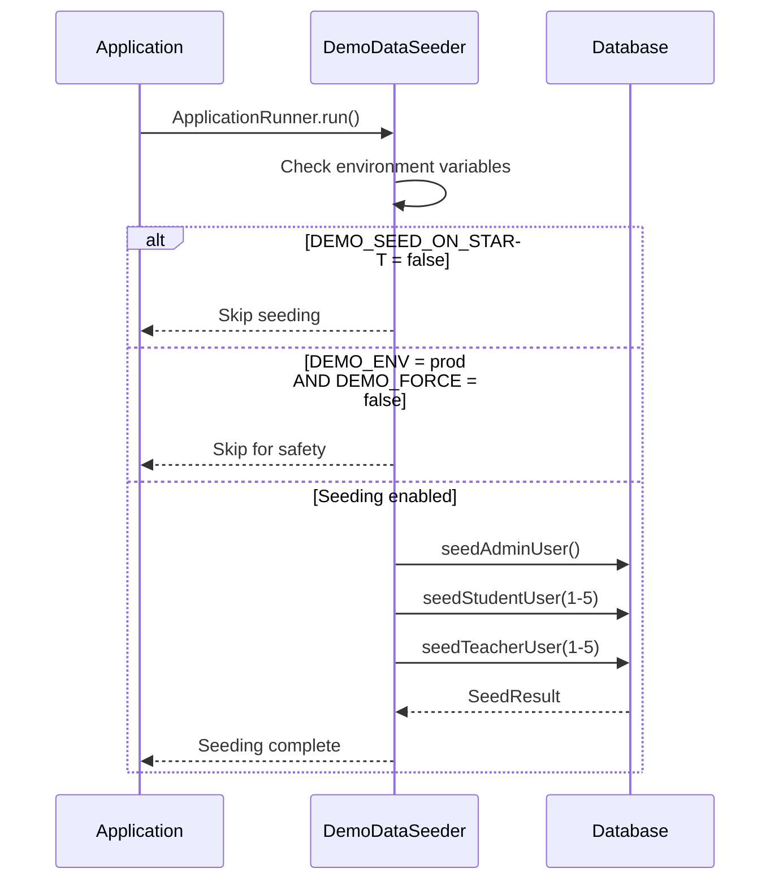

# Stage-1 Demo Data Seeding

## 🌱 **SEEDING OVERVIEW**

The demo data seeder provides a comprehensive set of test accounts and profile data for development and demonstration purposes. It creates realistic user accounts with complete profile information for testing all Stage-1 features.

## ⚙️ **SEEDER CONFIGURATION**

### **Environment Variables**

| Variable | Values | Default | Description |
|----------|--------|---------|-------------|
| `DEMO_SEED_ON_START` | `true`/`false` | `false` | Enable seeding on application startup |
| `DEMO_ENV` | `local`/`demo`/`prod` | `local` | Environment type for safety checks |
| `DEMO_FORCE` | `true`/`false` | `false` | Force seeding in production environment |

### **Safety Matrix**

| DEMO_ENV | DEMO_SEED_ON_START | DEMO_FORCE | Result |
|----------|-------------------|------------|---------|
| `local` | `true` | `false` | ✅ Seeds data |
| `demo` | `true` | `false` | ✅ Seeds data |
| `prod` | `true` | `false` | ❌ Blocked (safety) |
| `prod` | `true` | `true` | ⚠️ Seeds data (forced) |
| `*` | `false` | `*` | ❌ No seeding |

### **Configuration Examples**

#### **Development Environment**
```bash
DEMO_SEED_ON_START=true
DEMO_ENV=local
DEMO_FORCE=false
```

#### **Demo Environment**
```bash
DEMO_SEED_ON_START=true
DEMO_ENV=demo  
DEMO_FORCE=false
```

#### **Production (Safe)**
```bash
DEMO_SEED_ON_START=false
DEMO_ENV=prod
DEMO_FORCE=false
```

#### **Production (Forced)**
```bash
DEMO_SEED_ON_START=true
DEMO_ENV=prod
DEMO_FORCE=true
```

## 👥 **DEMO ACCOUNTS**

### **Account Overview**
- **Total Users**: 11
- **Admin Users**: 1
- **Student Users**: 5
- **Teacher Users**: 5
- **Common Password**: `Maza@123`

### **Admin Account**
| Field | Value |
|-------|-------|
| **Email** | `siddhartha@ankurshala.com` |
| **Password** | `Maza@123` |
| **Name** | `Siddhartha Admin` |
| **Role** | `ADMIN` |
| **Phone** | `+91-9876543210` |
| **Super Admin** | `true` |

### **Student Accounts**
| # | Email | Name | Password | School | Grade | Board |
|---|-------|------|----------|---------|-------|-------|
| 1 | `student1@ankurshala.com` | `Student 1` | `Maza@123` | `Delhi Public School 1` | `GRADE_8` | `CBSE` |
| 2 | `student2@ankurshala.com` | `Student 2` | `Maza@123` | `Delhi Public School 2` | `GRADE_8` | `CBSE` |
| 3 | `student3@ankurshala.com` | `Student 3` | `Maza@123` | `Delhi Public School 3` | `GRADE_8` | `CBSE` |
| 4 | `student4@ankurshala.com` | `Student 4` | `Maza@123` | `Delhi Public School 4` | `GRADE_8` | `CBSE` |
| 5 | `student5@ankurshala.com` | `Student 5` | `Maza@123` | `Delhi Public School 5` | `GRADE_8` | `CBSE` |

#### **Student Profile Details**
- **Mobile Numbers**: `+91-9876543211` to `+91-9876543215`
- **Educational Board**: `CBSE`
- **Class Level**: `GRADE_8`
- **School Names**: `Delhi Public School {1-5}`

### **Teacher Accounts**
| # | Email | Name | Password | Status | Experience | Bio |
|---|-------|------|----------|---------|------------|-----|
| 1 | `teacher1@ankurshala.com` | `Teacher 1` | `Maza@123` | `ACTIVE` | `6 years` | `Experienced teacher with 6 years of teaching experience` |
| 2 | `teacher2@ankurshala.com` | `Teacher 2` | `Maza@123` | `ACTIVE` | `7 years` | `Experienced teacher with 7 years of teaching experience` |
| 3 | `teacher3@ankurshala.com` | `Teacher 3` | `Maza@123` | `ACTIVE` | `8 years` | `Experienced teacher with 8 years of teaching experience` |
| 4 | `teacher4@ankurshala.com` | `Teacher 4` | `Maza@123` | `ACTIVE` | `9 years` | `Experienced teacher with 9 years of teaching experience` |
| 5 | `teacher5@ankurshala.com` | `Teacher 5` | `Maza@123` | `ACTIVE` | `10 years` | `Experienced teacher with 10 years of teaching experience` |

#### **Teacher Profile Details**
- **Mobile Numbers**: `+91-9876543211` to `+91-9876543215`
- **Status**: `ACTIVE`
- **Profile Structure**: Complete teacher + teacher_profile entries
- **Experience**: Varies from 6-10 years

## 🔄 **SEEDING BEHAVIOR**

### **Idempotency**
The seeder is **idempotent** - running it multiple times will not create duplicate data:

1. **Email Check**: Checks if user exists by email before creating
2. **Profile Check**: Checks if profiles exist before creating
3. **Upsert Logic**: Updates existing data if found, creates new if not
4. **Safe Operations**: No data loss on re-runs

### **Seeding Process Flow**


### **Data Creation Logic**

#### **Admin User Creation**
```java
private User seedAdminUser() {
    String email = "siddhartha@ankurshala.com";
    
    User user = userRepository.findByEmail(email).orElse(null);
    if (user == null) {
        user = new User();
        user.setName("Siddhartha Admin");
        user.setEmail(email);
        user.setPassword(passwordEncoder.encode("Maza@123"));
        user.setRole(Role.ADMIN);
        user.setEnabled(true);
        user = userRepository.save(user);

        // Create admin profile
        AdminProfile adminProfile = new AdminProfile(user);
        adminProfile.setPhoneNumber("+91-9876543210");
        adminProfile.setIsSuperAdmin(true);
        adminProfileRepository.save(adminProfile);
    }
    
    return user;
}
```

#### **Student User Creation**
```java
private User seedStudentUser(int studentNumber) {
    String email = "student" + studentNumber + "@ankurshala.com";
    
    User user = userRepository.findByEmail(email).orElse(null);
    if (user == null) {
        user = new User();
        user.setName("Student " + studentNumber);
        user.setEmail(email);
        user.setPassword(passwordEncoder.encode("Maza@123"));
        user.setRole(Role.STUDENT);
        user.setEnabled(true);
        user = userRepository.save(user);

        // Create student profile with academic info
        StudentProfile studentProfile = new StudentProfile();
        studentProfile.setUser(user);
        studentProfile.setFirstName("Student");
        studentProfile.setLastName(studentNumber + "");
        studentProfile.setMobileNumber("+91-987654321" + studentNumber);
        studentProfile.setEducationalBoard(EducationalBoard.CBSE);
        studentProfile.setClassLevel(ClassLevel.GRADE_8);
        studentProfile.setSchoolName("Delhi Public School " + studentNumber);
        studentProfileRepository.save(studentProfile);
    }
    
    return user;
}
```

#### **Teacher User Creation**
```java
private User seedTeacherUser(int teacherNumber) {
    String email = "teacher" + teacherNumber + "@ankurshala.com";
    
    User user = userRepository.findByEmail(email).orElse(null);
    if (user == null) {
        user = new User();
        user.setName("Teacher " + teacherNumber);
        user.setEmail(email);
        user.setPassword(passwordEncoder.encode("Maza@123"));
        user.setRole(Role.TEACHER);
        user.setEnabled(true);
        user = userRepository.save(user);
    }

    // Create Teacher entity
    Teacher teacher = teacherRepository.findByUserId(user.getId()).orElse(null);
    if (teacher == null) {
        teacher = new Teacher();
        teacher.setUser(user);
        teacher.setName("Teacher " + teacherNumber);
        teacher.setEmail(email);
        teacher.setStatus(TeacherStatus.ACTIVE);
        teacher = teacherRepository.save(teacher);
    }

    // Create TeacherProfile
    TeacherProfile teacherProfile = teacherProfileRepository.findByUserId(user.getId()).orElse(null);
    if (teacherProfile == null) {
        teacherProfile = new TeacherProfile();
        teacherProfile.setUser(user);
        teacherProfile.setTeacher(teacher);
        teacherProfile.setFirstName("Teacher");
        teacherProfile.setLastName(teacherNumber + "");
        teacherProfile.setMobileNumber("+91-987654321" + teacherNumber);
        teacherProfile.setBio("Experienced teacher with " + (5 + teacherNumber) + " years of teaching experience");
        teacherProfileRepository.save(teacherProfile);
    }

    return user;
}
```

## 🛠️ **MANUAL SEEDING**

### **Make Target**
```bash
# Seed demo data manually
make seed-dev
```

### **Dev Seeding Endpoint**
**Endpoint**: `POST /admin/dev-seed`
**Access**: Admin role required
**Environment**: Enabled only when `DEMO_ENV != prod` or `DEMO_FORCE = true`

#### **Sample Request**
```bash
curl -X POST http://localhost:8080/admin/dev-seed \
  -H "Authorization: Bearer your-admin-token"
```

#### **Sample Response**
```json
{
  "message": "Demo data seeded successfully",
  "result": {
    "adminUsersCreated": 1,
    "studentUsersCreated": 5,
    "teacherUsersCreated": 5
  },
  "timestamp": "2024-01-01T00:00:00Z"
}
```

### **Makefile Integration**
**File**: `Makefile`

```makefile
seed-dev:
	@echo "🌱 Seeding demo data..."
	@curl -X POST http://localhost:8080/admin/dev-seed \
		-H "Content-Type: application/json" \
		-H "Authorization: Bearer $(shell cat .admin-token 2>/dev/null || echo 'no-token')" \
		|| echo "⚠️  Manual seeding failed. Data may already exist or auth required."
	@echo "✅ Demo data seeding completed"
```

## 📊 **SEEDING RESULTS**

### **Success Output**
```
2024-01-01 10:00:00 INFO  DemoDataSeeder - Starting demo data seeding for environment: local
2024-01-01 10:00:01 INFO  DemoDataSeeder - Created admin user: siddhartha@ankurshala.com
2024-01-01 10:00:02 INFO  DemoDataSeeder - Created student user: student1@ankurshala.com
2024-01-01 10:00:03 INFO  DemoDataSeeder - Created student user: student2@ankurshala.com
2024-01-01 10:00:04 INFO  DemoDataSeeder - Created student user: student3@ankurshala.com
2024-01-01 10:00:05 INFO  DemoDataSeeder - Created student user: student4@ankurshala.com
2024-01-01 10:00:06 INFO  DemoDataSeeder - Created student user: student5@ankurshala.com
2024-01-01 10:00:07 INFO  DemoDataSeeder - Teacher user ready: teacher1@ankurshala.com
2024-01-01 10:00:08 INFO  DemoDataSeeder - Teacher user ready: teacher2@ankurshala.com
2024-01-01 10:00:09 INFO  DemoDataSeeder - Teacher user ready: teacher3@ankurshala.com
2024-01-01 10:00:10 INFO  DemoDataSeeder - Teacher user ready: teacher4@ankurshala.com
2024-01-01 10:00:11 INFO  DemoDataSeeder - Teacher user ready: teacher5@ankurshala.com
2024-01-01 10:00:12 INFO  DemoDataSeeder - Demo data seeding completed successfully: Admin: 1, Students: 5, Teachers: 5
```

### **Idempotent Re-run Output**
```
2024-01-01 10:05:00 INFO  DemoDataSeeder - Starting demo data seeding for environment: local
2024-01-01 10:05:01 INFO  DemoDataSeeder - Admin user already exists: siddhartha@ankurshala.com
2024-01-01 10:05:02 INFO  DemoDataSeeder - Student user already exists: student1@ankurshala.com
2024-01-01 10:05:03 INFO  DemoDataSeeder - Student user already exists: student2@ankurshala.com
2024-01-01 10:05:04 INFO  DemoDataSeeder - Student user already exists: student3@ankurshala.com
2024-01-01 10:05:05 INFO  DemoDataSeeder - Student user already exists: student4@ankurshala.com
2024-01-01 10:05:06 INFO  DemoDataSeeder - Student user already exists: student5@ankurshala.com
2024-01-01 10:05:07 INFO  DemoDataSeeder - Teacher user ready: teacher1@ankurshala.com
2024-01-01 10:05:08 INFO  DemoDataSeeder - Teacher user ready: teacher2@ankurshala.com
2024-01-01 10:05:09 INFO  DemoDataSeeder - Teacher user ready: teacher3@ankurshala.com
2024-01-01 10:05:10 INFO  DemoDataSeeder - Teacher user ready: teacher4@ankurshala.com
2024-01-01 10:05:11 INFO  DemoDataSeeder - Teacher user ready: teacher5@ankurshala.com
2024-01-01 10:05:12 INFO  DemoDataSeeder - Demo data seeding completed successfully: Admin: 0, Students: 0, Teachers: 0
```

## 🔒 **SECURITY CONSIDERATIONS**

### **Production Safety**
- **Default Behavior**: No seeding in production
- **Environment Check**: Validates `DEMO_ENV` setting
- **Force Override**: Requires explicit `DEMO_FORCE=true`
- **Logging**: All seeding operations logged

### **Password Security**
- **Hashing**: All passwords BCrypt hashed with cost factor 12
- **Common Password**: `Maza@123` for all demo accounts
- **Production Warning**: Never use demo passwords in production

### **Data Isolation**
- **Email Domains**: All demo accounts use `@ankurshala.com`
- **Naming Convention**: Clear demo user naming
- **Easy Cleanup**: Identifiable for removal

## 🧪 **TESTING INTEGRATION**

### **E2E Test Usage**
Demo accounts are used extensively in E2E tests:

```typescript
const demoCredentials = {
  admin: { email: 'siddhartha@ankurshala.com', password: 'Maza@123' },
  students: [
    { email: 'student1@ankurshala.com', password: 'Maza@123' },
    { email: 'student2@ankurshala.com', password: 'Maza@123' }
  ],
  teachers: [
    { email: 'teacher1@ankurshala.com', password: 'Maza@123' },
    { email: 'teacher2@ankurshala.com', password: 'Maza@123' }
  ]
}
```

### **Test Scenarios Covered**
- **Authentication**: Login/logout for all user types
- **Profile Management**: CRUD operations on profiles
- **Role-Based Access**: Cross-role access testing
- **Data Validation**: Form validation with seeded data

## 📋 **DEVELOPMENT WORKFLOW**

### **Local Development Setup**
```bash
# 1. Start infrastructure
make dev-up

# 2. Seed demo data (automatic on first run)
# Or manually trigger:
make seed-dev

# 3. Start frontend
make fe-dev

# 4. Access demo accounts
# Admin: siddhartha@ankurshala.com / Maza@123
# Student: student1@ankurshala.com / Maza@123
# Teacher: teacher1@ankurshala.com / Maza@123
```

### **Docker Compose Integration**
**File**: `docker-compose.dev.yml`

```yaml
services:
  backend:
    environment:
      - DEMO_SEED_ON_START=true
      - DEMO_ENV=local
      - DEMO_FORCE=false
```

## 🔄 **STAGE-2 SEEDING ENHANCEMENTS**

### **Planned Extensions**
1. **Rich Profile Data**
   - Complete teacher qualifications
   - Student academic history
   - Document uploads
   - Profile photos

2. **Relationship Data**
   - Teacher-student connections
   - Booking history
   - Review and rating data
   - Message history

3. **Advanced Configuration**
   - Configurable user counts
   - Custom data scenarios
   - Performance test data
   - Multi-environment profiles

4. **Data Management**
   - Seeding rollback capability
   - Selective data seeding
   - Data export/import
   - Automated cleanup

### **Enhanced Safety Features**
- **Environment Detection**: Automatic environment detection
- **Backup Integration**: Pre-seeding database backup
- **Audit Logging**: Detailed seeding audit trail
- **Rollback Capability**: Ability to undo seeding operations

## 📝 **USAGE SUMMARY**

### **Quick Start**
```bash
# Enable seeding
export DEMO_SEED_ON_START=true
export DEMO_ENV=local

# Start application (seeds automatically)
make dev-up

# Or seed manually
make seed-dev
```

### **Demo Account Access**
- **Admin Portal**: Login with `siddhartha@ankurshala.com / Maza@123`
- **Student Portal**: Login with `student1@ankurshala.com / Maza@123`
- **Teacher Portal**: Login with `teacher1@ankurshala.com / Maza@123`

### **Verification**
```bash
# Check seeded data
curl -X GET http://localhost:8080/api/user/me \
  -H "Authorization: Bearer your-token"

# Run E2E tests with seeded data
cd frontend && npm run test:e2e
```

**All demo accounts are ready for immediate testing and development! 🚀**
