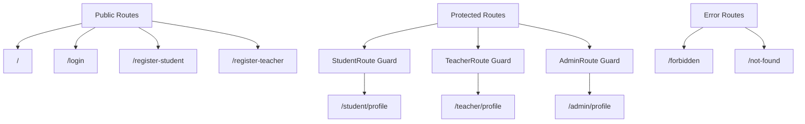
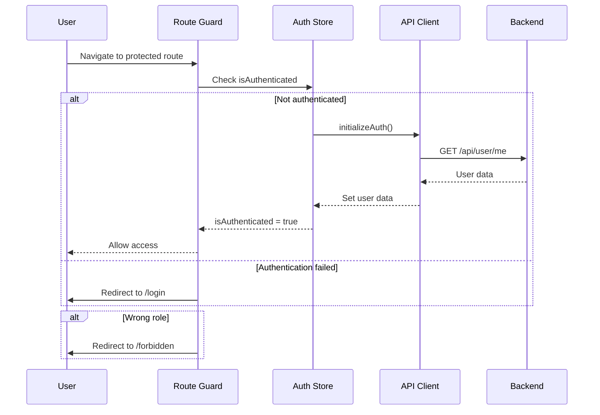

# Stage-1 Frontend Map

## 🗺️ **ROUTE STRUCTURE**

### **Next.js App Router Routes**
Based on the file-system routing in `frontend/src/app/`:

| Route | File Path | Purpose | Access Level |
|-------|-----------|---------|--------------|
| `/` | `app/page.tsx` | Landing page | Public |
| `/login` | `app/login/page.tsx` | User authentication | Public |
| `/register-student` | `app/register-student/page.tsx` | Student registration | Public |
| `/register-teacher` | `app/register-teacher/page.tsx` | Teacher registration | Public |
| `/student/profile` | `app/student/profile/page.tsx` | Student profile management | Student only |
| `/teacher/profile` | `app/teacher/profile/page.tsx` | Teacher profile management | Teacher only |
| `/admin/profile` | `app/admin/profile/page.tsx` | Admin profile management | Admin only |
| `/forbidden` | `app/forbidden/page.tsx` | Access denied page | Error page |
| `/not-found` | `app/not-found.tsx` | 404 error page | Error page |

### **Route Access Control**


## 📱 **COMPONENT ARCHITECTURE**

### **Component Tree Structure**

```mermaid
graph TD
    ROOT[RootLayout] --> PROVIDERS[Providers]
    ROOT --> NAVBAR[Navbar]
    
    PROVIDERS --> REACT_QUERY[React Query Client]
    PROVIDERS --> TOASTER[Sonner Toaster]
    
    NAVBAR --> AUTH_STATE[Auth State Display]
    NAVBAR --> LOGOUT[Logout Button]
    
    PAGES[Page Components] --> HOME_PAGE[Home Page]
    PAGES --> LOGIN_PAGE[Login Page]
    PAGES --> STUDENT_PAGE[Student Profile Page]
    PAGES --> TEACHER_PAGE[Teacher Profile Page]
    PAGES --> ADMIN_PAGE[Admin Profile Page]
    
    GUARDS[Route Guards] --> STUDENT_ROUTE[StudentRoute]
    GUARDS --> TEACHER_ROUTE[TeacherRoute]
    GUARDS --> ADMIN_ROUTE[AdminRoute]
    
    STUDENT_PAGE --> STUDENT_TABS[Profile Tabs]
    STUDENT_TABS --> PERSONAL_TAB[Personal Info]
    STUDENT_TABS --> ACADEMIC_TAB[Academic Info]
    STUDENT_TABS --> DOCUMENTS_TAB[Documents]
    
    TEACHER_PAGE --> TEACHER_TABS[Profile Tabs]
    TEACHER_TABS --> PROFILE_TAB[Profile]
    TEACHER_TABS --> PROFESSIONAL_TAB[Professional Info]
    TEACHER_TABS --> QUALIFICATIONS_TAB[Qualifications]
    TEACHER_TABS --> EXPERIENCE_TAB[Experience]
    TEACHER_TABS --> CERTIFICATIONS_TAB[Certifications]
    TEACHER_TABS --> AVAILABILITY_TAB[Availability]
    TEACHER_TABS --> ADDRESSES_TAB[Addresses]
    TEACHER_TABS --> BANK_TAB[Bank Details]
    TEACHER_TABS --> TEACHER_DOCS_TAB[Documents]
```


### **Core Components**

#### **Layout Components**
| Component | File Path | Purpose |
|-----------|-----------|---------|
| `RootLayout` | `app/layout.tsx` | Root layout with metadata and providers |
| `Navbar` | `components/navbar.tsx` | Navigation bar with user info and logout |
| `Providers` | `components/providers.tsx` | React Query and Toast providers |

#### **Route Protection**
| Component | File Path | Purpose |
|-----------|-----------|---------|
| `RouteGuard` | `components/route-guard.tsx` | Base authentication guard |
| `StudentRoute` | `components/route-guard.tsx` | Student-only route protection |
| `TeacherRoute` | `components/route-guard.tsx` | Teacher-only route protection |
| `AdminRoute` | `components/route-guard.tsx` | Admin-only route protection |

#### **UI Components**
| Component | File Path | Purpose |
|-----------|-----------|---------|
| `Button` | `components/ui/button.tsx` | Reusable button component |
| `Card` | `components/ui/card.tsx` | Card container components |

## 🎯 **DATA-TESTID REGISTRY**

### **Test Identifiers for Playwright**
Used by E2E tests for reliable element selection:

#### **Student Profile Page**
| Test ID | Element | Purpose |
|---------|---------|---------|
| `student-profile-root` | Main container | Page root identification |
| `student-profile-loading` | Loading state | Loading state detection |
| `input-first-name` | First name input | Form field testing |
| `input-school-name` | School name input | Form field testing |
| `save-personal-info` | Save button | Form submission testing |
| `tab-documents` | Documents tab | Tab navigation testing |
| `panel-documents` | Documents panel | Tab content testing |
| `input-document-name` | Document name input | Document form testing |
| `student-documents-add-url` | Document URL input | Document form testing |

#### **Teacher Profile Page**
| Test ID | Element | Purpose |
|---------|---------|---------|
| `teacher-profile-root` | Main container | Page root identification |
| `teacher-profile-loading` | Loading state | Loading state detection |
| `tab-profile` | Profile tab | Tab navigation |
| `tab-professional` | Professional tab | Tab navigation |
| `tab-qualifications` | Qualifications tab | Tab navigation |
| `tab-experience` | Experience tab | Tab navigation |
| `tab-certifications` | Certifications tab | Tab navigation |
| `tab-availability` | Availability tab | Tab navigation |
| `tab-addresses` | Addresses tab | Tab navigation |
| `tab-bank-details` | Bank details tab | Tab navigation |
| `tab-documents` | Documents tab | Tab navigation |

#### **Admin Profile Page**
| Test ID | Element | Purpose |
|---------|---------|---------|
| `admin-profile-root` | Main container | Page root identification |
| `admin-profile-loading` | Loading state | Loading state detection |
| `input-phone-number` | Phone input | Form field testing |
| `save-admin-profile` | Save button | Form submission testing |

#### **Authentication Pages**
| Test ID | Element | Purpose |
|---------|---------|---------|
| `login-form` | Login form | Form identification |
| `input-email` | Email input | Login form testing |
| `input-password` | Password input | Login form testing |
| `login-submit` | Login button | Form submission |
| `register-student-form` | Student registration form | Registration testing |
| `register-teacher-form` | Teacher registration form | Registration testing |

## 🔄 **STATE MANAGEMENT**

### **Zustand Auth Store**
**File**: `frontend/src/store/auth.ts`

```typescript
interface AuthState {
  user: User | null
  isAuthenticated: boolean
  login: (user: User) => void
  logout: () => void
  initializeAuth: () => Promise<void>
}

interface User {
  id: string
  email: string
  name: string
  role: 'STUDENT' | 'TEACHER' | 'ADMIN'
}
```

**Store Methods**:
- `login(user)` - Set authenticated user
- `logout()` - Clear user data and redirect
- `initializeAuth()` - Initialize auth state from tokens

### **React Query Configuration**
**File**: `frontend/src/components/providers.tsx`

```typescript
const queryClient = new QueryClient({
  defaultOptions: {
    queries: {
      staleTime: 5 * 60 * 1000, // 5 minutes
      retry: 2,
    },
  },
})
```

**Query Keys**:
- `['student', 'profile', userId]` - Student profile data
- `['student', 'documents', userId]` - Student documents
- `['teacher', 'profile', userId]` - Teacher profile data
- `['teacher', 'qualifications', userId]` - Teacher qualifications
- `['admin', 'profile', userId]` - Admin profile data

## 🌐 **API CLIENT CONFIGURATION**

### **Axios Configuration**
**File**: `frontend/src/lib/apiClient.ts`

```typescript
const apiClient = axios.create({
  baseURL: process.env.NEXT_PUBLIC_API_BASE || 'http://localhost:8080/api',
  timeout: 10000,
})
```

### **Token Management**
**Request Interceptor**:
```typescript
apiClient.interceptors.request.use((config) => {
  const token = localStorage.getItem('accessToken')
  if (token) {
    config.headers.Authorization = `Bearer ${token}`
  }
  return config
})
```

**Response Interceptor**:
```typescript
apiClient.interceptors.response.use(
  (response) => response,
  async (error) => {
    if (error.response?.status === 401) {
      try {
        await refreshToken()
        // Retry original request
        return apiClient.request(error.config)
      } catch (refreshError) {
        logout()
        window.location.href = '/login'
      }
    }
    return Promise.reject(error)
  }
)
```

### **API Methods**

#### **Authentication API**
```typescript
export const authAPI = {
  signin: (email: string, password: string) => 
    apiClient.post('/auth/signin', { email, password }),
  
  signupStudent: (data: SignupData) => 
    apiClient.post('/auth/signup/student', data),
  
  signupTeacher: (data: SignupData) => 
    apiClient.post('/auth/signup/teacher', data),
  
  refresh: (refreshToken: string) => 
    apiClient.post('/auth/refresh', { refreshToken }),
  
  logout: (refreshToken: string) => 
    apiClient.post('/auth/logout', { refreshToken })
}
```

#### **Student API**
```typescript
export const studentAPI = {
  getProfile: () => apiClient.get('/student/profile'),
  updateProfile: (data: any) => apiClient.put('/student/profile', data),
  getDocuments: () => apiClient.get('/student/profile/documents'),
  addDocument: (data: any) => apiClient.post('/student/profile/documents', data),
  deleteDocument: (id: number) => apiClient.delete(`/student/profile/documents/${id}`)
}
```

#### **Teacher API**
```typescript
export const teacherAPI = {
  getProfile: () => apiClient.get('/teacher/profile'),
  updateProfile: (data: any) => apiClient.put('/teacher/profile', data),
  getQualifications: () => apiClient.get('/teacher/profile/qualifications'),
  addQualification: (data: any) => apiClient.post('/teacher/profile/qualifications', data),
  // ... other nested resource methods
}
```

#### **Admin API**
```typescript
export const adminAPI = {
  getProfile: () => apiClient.get('/admin/profile'),
  updateProfile: (data: any) => apiClient.put('/admin/profile', data)
}
```

## 🛡️ **ROUTE GUARDS & AUTHENTICATION**

### **Authentication Flow**


### **Route Guard Implementation**
**File**: `frontend/src/components/route-guard.tsx`

```typescript
export function StudentRoute({ children }: { children: React.ReactNode }) {
  const { user, isAuthenticated, initializeAuth } = useAuthStore()
  const router = useRouter()
  const [authInitialized, setAuthInitialized] = useState(false)

  useEffect(() => {
    const init = async () => {
      if (!isAuthenticated) {
        await initializeAuth()
      }
      setTimeout(() => setAuthInitialized(true), 50)
    }
    init()
  }, [isAuthenticated, initializeAuth])

  if (!authInitialized) {
    return <div>Loading...</div>
  }

  if (!isAuthenticated) {
    router.push('/login')
    return null
  }

  if (user?.role !== 'STUDENT') {
    router.push('/forbidden')
    return null
  }

  return <>{children}</>
}
```

## 🎨 **UI LIBRARY & STYLING**

### **CSS Framework**
- **Tailwind CSS**: Utility-first CSS framework
- **Configuration**: `tailwind.config.ts`
- **Global Styles**: `app/globals.css`

### **Component Library**
- **shadcn/ui**: Reusable component library
- **Components**: Button, Card, Input, Select, etc.
- **Customization**: Tailwind-based styling

### **Toast Notifications**
- **Library**: Sonner
- **Provider**: `components/providers.tsx`
- **Usage**: `toast.success()`, `toast.error()`

## 📱 **RESPONSIVE DESIGN**

### **Breakpoints**
| Breakpoint | Width | Usage |
|------------|-------|-------|
| `sm` | 640px+ | Small tablets |
| `md` | 768px+ | Tablets |
| `lg` | 1024px+ | Laptops |
| `xl` | 1280px+ | Desktops |

### **Mobile-First Approach**
- Base styles for mobile
- Progressive enhancement for larger screens
- Responsive navigation and forms
- Touch-friendly button sizes

## 🔧 **DEVELOPMENT TOOLS**

### **TypeScript Configuration**
- **Strict Mode**: Enabled
- **Path Aliases**: `@/` for `src/`
- **Type Checking**: Build-time validation

### **ESLint & Prettier**
- **Linting**: Code quality enforcement
- **Formatting**: Consistent code style
- **Pre-commit Hooks**: Automated checks

### **Environment Variables**
```bash
NEXT_PUBLIC_API_BASE=http://localhost:8080/api
NEXT_PUBLIC_APP_NAME=AnkurShala
NEXT_PUBLIC_APP_VERSION=1.0.0
```

## 🧪 **TESTING INTEGRATION**

### **Playwright E2E Tests**
- **Test Files**: `frontend/tests/e2e.*.spec.ts`
- **Test IDs**: Stable selectors for reliable testing
- **Coverage**: 100% of user flows tested

### **Test Scripts**
```json
{
  "test:e2e": "playwright test",
  "test:e2e:headed": "playwright test --headed",
  "test:e2e:trace": "playwright test --trace on"
}
```

## 🚀 **PERFORMANCE OPTIMIZATIONS**

### **Next.js Features**
- **App Router**: File-system based routing
- **Server Components**: Reduced client-side JavaScript
- **Image Optimization**: Next.js Image component
- **Bundle Splitting**: Automatic code splitting

### **React Query Benefits**
- **Caching**: Automatic data caching
- **Background Updates**: Stale-while-revalidate
- **Optimistic Updates**: Immediate UI feedback
- **Error Boundaries**: Graceful error handling

## 📋 **STAGE-2 FRONTEND EXTENSIONS**

### **Planned Features**
1. **Real-time Features**
   - WebSocket integration
   - Live notifications
   - Chat components

2. **Advanced UI Components**
   - Calendar/scheduler
   - Video call interface
   - File upload components
   - Advanced search/filtering

3. **Enhanced UX**
   - Progressive Web App (PWA)
   - Offline support
   - Push notifications
   - Advanced animations

4. **Additional Routes**
   - `/booking` - Booking management
   - `/sessions` - Video session interface
   - `/payments` - Payment processing
   - `/messages` - Chat interface
   - `/calendar` - Calendar view
   - `/search` - Teacher/student search

### **Technical Enhancements**
- **State Management**: Extend Zustand stores
- **API Integration**: WebSocket connections
- **Performance**: Bundle optimization
- **Accessibility**: WCAG compliance
- **Internationalization**: Multi-language support
