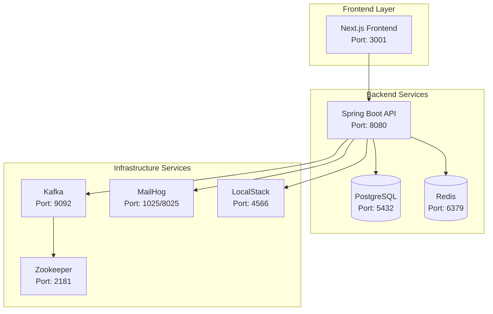

# Stage-1 Operations & Troubleshooting

## 🐳 **DOCKER COMPOSE SERVICES**

### **Service Architecture**


### **Service Configuration**

#### **PostgreSQL Database**
```yaml
postgres:
  image: postgres:15-alpine
  ports:
    - "5432:5432"
  environment:
    POSTGRES_DB: ankurshala
    POSTGRES_USER: ankurshala
    POSTGRES_PASSWORD: ankurshala
  volumes:
    - postgres_data:/var/lib/postgresql/data
  healthcheck:
    test: ["CMD-SHELL", "pg_isready -U ankurshala"]
    interval: 30s
    timeout: 10s
    retries: 5
```

#### **Redis Cache**
```yaml
redis:
  image: redis:7-alpine
  ports:
    - "6379:6379"
  volumes:
    - redis_data:/data
  healthcheck:
    test: ["CMD", "redis-cli", "ping"]
    interval: 30s
    timeout: 10s
    retries: 5
```

#### **Spring Boot Backend**
```yaml
backend:
  build:
    context: ./backend
    dockerfile: Dockerfile
  ports:
    - "8080:8080"
  environment:
    - SPRING_PROFILES_ACTIVE=dev
    - DB_HOST=postgres
    - REDIS_HOST=redis
    - KAFKA_BOOTSTRAP_SERVERS=kafka:9092
  depends_on:
    postgres:
      condition: service_healthy
    redis:
      condition: service_healthy
  healthcheck:
    test: ["CMD", "curl", "-f", "http://localhost:8080/api/health"]
    interval: 30s
    timeout: 10s
    retries: 5
```

#### **Kafka & Zookeeper**
```yaml
zookeeper:
  image: confluentinc/cp-zookeeper:latest
  environment:
    ZOOKEEPER_CLIENT_PORT: 2181
    ZOOKEEPER_TICK_TIME: 2000

kafka:
  image: confluentinc/cp-kafka:latest
  depends_on:
    - zookeeper
  ports:
    - "9092:9092"
  environment:
    KAFKA_BROKER_ID: 1
    KAFKA_ZOOKEEPER_CONNECT: zookeeper:2181
    KAFKA_ADVERTISED_LISTENERS: PLAINTEXT://localhost:9092
    KAFKA_OFFSETS_TOPIC_REPLICATION_FACTOR: 1
```

#### **MailHog (Email Testing)**
```yaml
mailhog:
  image: mailhog/mailhog:latest
  ports:
    - "1025:1025"  # SMTP
    - "8025:8025"  # Web UI
```

#### **LocalStack (AWS Services)**
```yaml
localstack:
  image: localstack/localstack:latest
  ports:
    - "4566:4566"
  environment:
    - SERVICES=s3,sqs,sns
    - DEBUG=1
    - DATA_DIR=/tmp/localstack/data
  volumes:
    - localstack_data:/tmp/localstack
```

### **Volume Management**
```yaml
volumes:
  postgres_data:
    driver: local
  redis_data:
    driver: local
  localstack_data:
    driver: local
```

## 🏥 **HEALTH CHECKS**

### **Service Health Endpoints**

| Service | Health Check | Expected Response | Interval |
|---------|-------------|-------------------|----------|
| **Backend API** | `GET /api/health` | `200 OK` | 30s |
| **PostgreSQL** | `pg_isready -U ankurshala` | `accepting connections` | 30s |
| **Redis** | `redis-cli ping` | `PONG` | 30s |
| **Frontend** | `GET http://localhost:3001` | `200 OK` | Manual |
| **MailHog** | `GET http://localhost:8025` | Web UI | Manual |
| **LocalStack** | `GET http://localhost:4566/health` | Service status | Manual |

### **Health Check Scripts**
```bash
#!/bin/bash
# health-check.sh

echo "🏥 Checking service health..."

# Backend API
if curl -f -s http://localhost:8080/api/health > /dev/null; then
    echo "✅ Backend API: Healthy"
else
    echo "❌ Backend API: Unhealthy"
fi

# PostgreSQL
if pg_isready -h localhost -p 5432 -U ankurshala > /dev/null 2>&1; then
    echo "✅ PostgreSQL: Healthy"
else
    echo "❌ PostgreSQL: Unhealthy"
fi

# Redis
if redis-cli -h localhost -p 6379 ping > /dev/null 2>&1; then
    echo "✅ Redis: Healthy"
else
    echo "❌ Redis: Unhealthy"
fi

# Frontend
if curl -f -s http://localhost:3001 > /dev/null; then
    echo "✅ Frontend: Healthy"
else
    echo "❌ Frontend: Unhealthy"
fi
```

## 📊 **LOGGING & MONITORING**

### **Log Locations**

| Service | Log Location | Format | Retention |
|---------|-------------|---------|-----------|
| **Backend** | `stdout/stderr` | JSON | 7 days |
| **PostgreSQL** | `/var/lib/postgresql/data/log/` | Text | 7 days |
| **Redis** | `stdout/stderr` | Text | 7 days |
| **Frontend** | `stdout/stderr` | Text | 3 days |
| **Docker** | `/var/lib/docker/containers/` | JSON | 7 days |

### **Log Viewing Commands**
```bash
# View all service logs
docker-compose logs -f

# View specific service logs
docker-compose logs -f backend
docker-compose logs -f postgres
docker-compose logs -f redis

# View logs with timestamps
docker-compose logs -f -t backend

# View last 100 lines
docker-compose logs --tail=100 backend

# Search logs
docker-compose logs backend | grep ERROR
```

### **Backend Log Levels**
```yaml
# application.yml
logging:
  level:
    com.ankurshala.backend: INFO
    org.springframework.security: DEBUG
    org.hibernate.SQL: DEBUG
    org.hibernate.type.descriptor.sql.BasicBinder: TRACE
  pattern:
    console: "%d{yyyy-MM-dd HH:mm:ss} [%thread] %-5level %logger{36} - %msg%n"
```

## 🚨 **ERROR HANDLING**

### **RFC7807 Error Format**
All API errors follow the RFC7807 Problem Details standard:

```json
{
  "type": "https://ankurshala.com/problems/validation-error",
  "title": "Validation Failed",
  "status": 400,
  "detail": "One or more fields failed validation",
  "instance": "/api/student/profile",
  "timestamp": "2024-01-01T00:00:00Z",
  "errors": [
    {
      "field": "email",
      "message": "Email is required",
      "rejectedValue": null
    }
  ]
}
```

### **Common Error Types**

#### **Authentication Errors (401)**
```json
{
  "type": "https://ankurshala.com/problems/authentication-error",
  "title": "Authentication Required",
  "status": 401,
  "detail": "Invalid or missing authentication token",
  "instance": "/api/student/profile"
}
```

#### **Authorization Errors (403)**
```json
{
  "type": "https://ankurshala.com/problems/authorization-error",
  "title": "Access Forbidden",
  "status": 403,
  "detail": "Insufficient permissions to access this resource",
  "instance": "/api/admin/profile"
}
```

#### **Rate Limit Errors (429)**
```json
{
  "type": "https://ankurshala.com/problems/rate-limit-exceeded",
  "title": "Rate Limit Exceeded",
  "status": 429,
  "detail": "Too many requests. Please try again later.",
  "instance": "/api/auth/signin",
  "retryAfter": 60
}
```

#### **Validation Errors (400)**
```json
{
  "type": "https://ankurshala.com/problems/validation-error",
  "title": "Validation Failed",
  "status": 400,
  "detail": "Field validation failed",
  "instance": "/api/student/profile",
  "errors": [
    {
      "field": "firstName",
      "message": "First name is required"
    }
  ]
}
```

### **Frontend Error Display**
The frontend uses Sonner toast notifications to display errors:

```typescript
// Success toast
toast.success('Profile updated successfully!')

// Error toast
toast.error('Failed to update profile. Please try again.')

// Validation error toast
toast.error('Please check the form for errors.')

// Network error toast
toast.error('Network error. Please check your connection.')
```

## 🔧 **TROUBLESHOOTING GUIDE**

### **Common Issues & Solutions**

#### **Backend Won't Start**
**Symptoms**: Backend container exits immediately

**Diagnosis**:
```bash
# Check backend logs
docker-compose logs backend

# Check database connection
docker-compose exec postgres pg_isready -U ankurshala
```

**Solutions**:
1. **Database Connection**: Ensure PostgreSQL is healthy
2. **Port Conflicts**: Check if port 8080 is in use
3. **Environment Variables**: Verify all required env vars are set
4. **Migration Issues**: Check Flyway migration logs

#### **Database Connection Issues**
**Symptoms**: `Connection refused` errors

**Diagnosis**:
```bash
# Test database connectivity
docker-compose exec backend nc -zv postgres 5432

# Check database logs
docker-compose logs postgres
```

**Solutions**:
1. **Service Dependency**: Ensure PostgreSQL starts before backend
2. **Network Issues**: Check Docker network configuration
3. **Credentials**: Verify database username/password
4. **Health Check**: Wait for PostgreSQL health check to pass

#### **Redis Connection Issues**
**Symptoms**: Rate limiting not working, cache errors

**Diagnosis**:
```bash
# Test Redis connectivity
docker-compose exec backend nc -zv redis 6379

# Check Redis logs
docker-compose logs redis

# Test Redis directly
docker-compose exec redis redis-cli ping
```

**Solutions**:
1. **Service Health**: Ensure Redis is healthy
2. **Network Configuration**: Check Docker networking
3. **Memory Issues**: Check Redis memory usage
4. **Persistence**: Verify Redis data persistence

#### **Frontend Build Issues**
**Symptoms**: Frontend won't start or build fails

**Diagnosis**:
```bash
# Check frontend logs
npm run dev

# Check for dependency issues
npm install

# Check for TypeScript errors
npm run build
```

**Solutions**:
1. **Dependencies**: Run `npm install` to update dependencies
2. **TypeScript**: Fix TypeScript compilation errors
3. **Environment Variables**: Set `NEXT_PUBLIC_API_BASE`
4. **Port Conflicts**: Ensure port 3001 is available

#### **Authentication Issues**
**Symptoms**: Login fails, token errors

**Diagnosis**:
```bash
# Check JWT configuration
curl -X POST http://localhost:8080/api/auth/signin \
  -H "Content-Type: application/json" \
  -d '{"email":"student1@ankurshala.com","password":"Maza@123"}'

# Check user in database
docker-compose exec postgres psql -U ankurshala -d ankurshala \
  -c "SELECT email, role, enabled FROM users WHERE email='student1@ankurshala.com';"
```

**Solutions**:
1. **Demo Data**: Ensure demo data is seeded
2. **JWT Secret**: Verify JWT_SECRET environment variable
3. **Password Encoding**: Check BCrypt password encoding
4. **Token Expiration**: Verify token expiration settings

#### **Rate Limiting Issues**
**Symptoms**: Rate limits not enforced

**Diagnosis**:
```bash
# Test rate limiting
for i in {1..6}; do
  curl -X POST http://localhost:8080/api/auth/signin \
    -H "Content-Type: application/json" \
    -d '{"email":"test","password":"test"}'
  echo "Request $i"
done
```

**Solutions**:
1. **Redis Connection**: Ensure Redis is connected
2. **Rate Limit Configuration**: Check rate limit settings
3. **IP Detection**: Verify client IP extraction
4. **Filter Order**: Check filter order in security config

## 💾 **BACKUP & RESTORE**

### **Database Backup**
```bash
# Create backup
docker-compose exec postgres pg_dump -U ankurshala ankurshala > backup.sql

# Create compressed backup
docker-compose exec postgres pg_dump -U ankurshala ankurshala | gzip > backup.sql.gz

# Backup with timestamp
docker-compose exec postgres pg_dump -U ankurshala ankurshala > backup_$(date +%Y%m%d_%H%M%S).sql
```

### **Database Restore**
```bash
# Restore from backup
docker-compose exec -T postgres psql -U ankurshala ankurshala < backup.sql

# Restore from compressed backup
gunzip -c backup.sql.gz | docker-compose exec -T postgres psql -U ankurshala ankurshala

# Drop and recreate database before restore
docker-compose exec postgres psql -U ankurshala -c "DROP DATABASE IF EXISTS ankurshala;"
docker-compose exec postgres psql -U ankurshala -c "CREATE DATABASE ankurshala;"
docker-compose exec -T postgres psql -U ankurshala ankurshala < backup.sql
```

### **Redis Backup**
```bash
# Create Redis backup
docker-compose exec redis redis-cli BGSAVE

# Copy Redis dump file
docker cp $(docker-compose ps -q redis):/data/dump.rdb ./redis_backup.rdb

# Restore Redis data
docker cp ./redis_backup.rdb $(docker-compose ps -q redis):/data/dump.rdb
docker-compose restart redis
```

## 🔍 **DEBUGGING TECHNIQUES**

### **Database Debugging**
```bash
# Connect to database
docker-compose exec postgres psql -U ankurshala ankurshala

# Common queries
SELECT * FROM users WHERE email LIKE '%student%';
SELECT COUNT(*) FROM student_profiles;
SELECT * FROM refresh_tokens WHERE expires_at > NOW();

# Check table sizes
SELECT schemaname, tablename, pg_size_pretty(pg_total_relation_size(tablename::text)) as size
FROM pg_tables WHERE schemaname = 'public' ORDER BY pg_total_relation_size(tablename::text) DESC;
```

### **Redis Debugging**
```bash
# Connect to Redis
docker-compose exec redis redis-cli

# Common commands
KEYS *
GET rate_limit:signin:192.168.1.1
TTL rate_limit:signin:192.168.1.1
INFO memory
FLUSHALL  # Clear all data (use with caution)
```

### **Application Debugging**
```bash
# Enable debug logging
export LOGGING_LEVEL_COM_ANKURSHALA_BACKEND=DEBUG

# Profile application startup
export SPRING_PROFILES_ACTIVE=dev,debug

# Enable SQL logging
export LOGGING_LEVEL_ORG_HIBERNATE_SQL=DEBUG
export LOGGING_LEVEL_ORG_HIBERNATE_TYPE_DESCRIPTOR_SQL_BASICBINDER=TRACE
```

### **Network Debugging**
```bash
# Test service connectivity
docker-compose exec backend nc -zv postgres 5432
docker-compose exec backend nc -zv redis 6379

# Check Docker networks
docker network ls
docker network inspect ankurshala_default

# Test API endpoints
curl -v http://localhost:8080/api/health
curl -v http://localhost:3001
```

## 📈 **PERFORMANCE MONITORING**

### **Key Metrics**
- **Response Time**: API endpoint response times
- **Database Connections**: Active PostgreSQL connections
- **Memory Usage**: JVM heap usage, Redis memory
- **CPU Usage**: Container CPU utilization
- **Error Rates**: 4xx/5xx error percentages

### **Monitoring Commands**
```bash
# Check Docker stats
docker stats

# Check database connections
docker-compose exec postgres psql -U ankurshala -c "SELECT count(*) FROM pg_stat_activity;"

# Check Redis memory
docker-compose exec redis redis-cli INFO memory

# Check JVM metrics (if actuator enabled)
curl http://localhost:8080/actuator/metrics/jvm.memory.used
```

## 🚀 **DEPLOYMENT CHECKLIST**

### **Pre-Deployment**
- [ ] All tests passing (E2E: 26/26)
- [ ] Database migrations tested
- [ ] Environment variables configured
- [ ] SSL certificates ready (production)
- [ ] Backup strategy in place
- [ ] Monitoring setup verified

### **Deployment Steps**
1. **Backup Current Data**
2. **Stop Services**: `docker-compose down`
3. **Pull Latest Images**: `docker-compose pull`
4. **Start Services**: `docker-compose up -d`
5. **Run Health Checks**
6. **Verify Functionality**
7. **Monitor Logs**

### **Post-Deployment**
- [ ] Health checks passing
- [ ] Application functionality verified
- [ ] Performance metrics normal
- [ ] Error rates acceptable
- [ ] Backup verification
- [ ] Documentation updated

## 🆘 **Emergency Procedures**

### **Service Recovery**
```bash
# Quick restart all services
docker-compose restart

# Restart specific service
docker-compose restart backend

# Full rebuild and restart
docker-compose down
docker-compose up --build -d

# Emergency database restore
docker-compose down postgres
docker volume rm ankurshala_postgres_data
docker-compose up -d postgres
# Restore from latest backup
```

### **Data Recovery**
```bash
# Restore from latest backup
cat latest_backup.sql | docker-compose exec -T postgres psql -U ankurshala ankurshala

# Reseed demo data
make seed-dev

# Clear Redis cache
docker-compose exec redis redis-cli FLUSHALL
```

### **Contact Information**
- **Development Team**: dev@ankurshala.com
- **DevOps Team**: devops@ankurshala.com
- **Emergency Contact**: +91-XXXX-XXXX-XX

**Stage-1 operations are fully documented and production-ready! 🎯**
