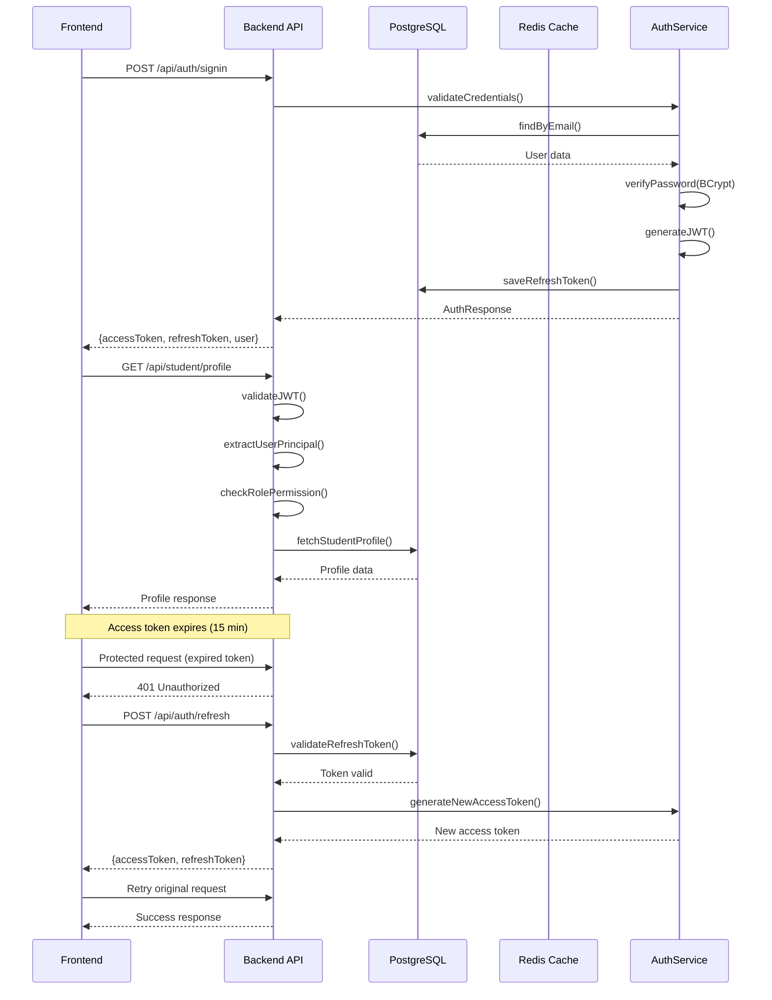
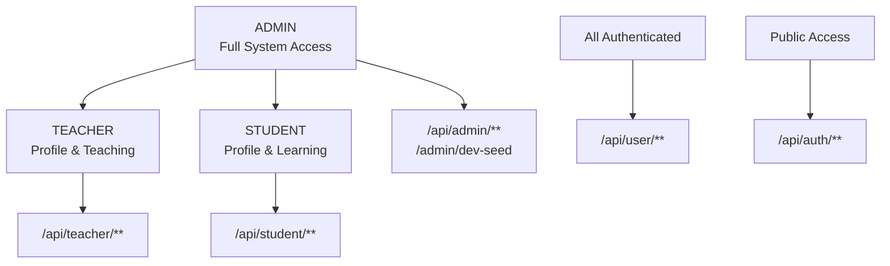

# Stage-1 Security & RBAC

## 🔐 **AUTHENTICATION ARCHITECTURE**

### **JWT Token Flow Diagram**


### **Token Configuration**
| Token Type | Expiration | Storage | Purpose |
|------------|------------|---------|---------|
| **Access Token** | 15 minutes | Frontend memory/localStorage | API authentication |
| **Refresh Token** | 7 days | Database + Frontend | Token renewal |
| **Algorithm** | HS256 | - | JWT signing algorithm |
| **Secret** | Environment variable | `JWT_SECRET` | Token signing key |

### **Password Security**
- **Hashing Algorithm**: BCrypt
- **Cost Factor**: 12 (2^12 iterations)
- **Implementation**: `BCryptPasswordEncoder`
- **Validation**: Automatic via Spring Security

**Example BCrypt Hash**:
```
$2a$12$LQv3c1yqBWVHxkd0LHAkCOYz6TtxMQJqhN8/LewdBPj4/LewdBPj4
│  │   │                            │
│  │   │                            └─ Hash (22 chars + 31 chars)
│  │   └─ Salt (22 characters)
│  └─ Cost factor (12)
└─ Algorithm identifier (2a)
```

## 🛡️ **ROLE-BASED ACCESS CONTROL (RBAC)**

### **Role Hierarchy**


### **Route Protection Matrix**

| Route Pattern | Required Role | Access Level | Controller |
|---------------|---------------|--------------|------------|
| `/api/auth/**` | `None` | Public | `AuthController` |
| `/api/health/**` | `None` | Public | Health Check |
| `/api/actuator/**` | `None` | Public | Spring Actuator |
| `/api/user/**` | `Authenticated` | Any authenticated user | `UserController` |
| `/api/student/**` | `STUDENT` | Student-only access | `StudentProfileController` |
| `/api/teacher/**` | `TEACHER` | Teacher-only access | `TeacherProfileController` |
| `/api/admin/**` | `ADMIN` | Admin-only access | `AdminProfileController` |
| `/admin/dev-seed` | `ADMIN` | Dev environment only | `DevController` |

### **Security Configuration**
**File**: `backend/src/main/java/com/ankurshala/backend/config/SecurityConfig.java`

```java
@Configuration
@EnableWebSecurity
@EnableMethodSecurity(prePostEnabled = true)
public class SecurityConfig {
    
    @Bean
    public SecurityFilterChain filterChain(HttpSecurity http) throws Exception {
        http.cors().and().csrf().disable()
            .sessionManagement().sessionCreationPolicy(SessionCreationPolicy.STATELESS)
            .and()
            .authorizeHttpRequests(auth -> auth
                .requestMatchers("/api/auth/**").permitAll()
                .requestMatchers("/api/health/**").permitAll()
                .requestMatchers("/api/actuator/**").permitAll()
                .requestMatchers("/api/user/**").authenticated()
                .requestMatchers("/api/student/**").hasRole("STUDENT")
                .requestMatchers("/api/teacher/**").hasRole("TEACHER")
                .requestMatchers("/api/admin/**").hasRole("ADMIN")
                .anyRequest().authenticated()
            )
            .addFilterBefore(jwtAuthenticationFilter, UsernamePasswordAuthenticationFilter.class);
        
        return http.build();
    }
}
```

### **Method-Level Security**

#### **@PreAuthorize Examples**

**Ownership-Based Access**:
```java
@PreAuthorize("hasRole('STUDENT')")
@GetMapping("/profile")
public ResponseEntity<StudentProfileDto> getProfile(Authentication authentication) {
    Long userId = getUserIdFromAuthentication(authentication);
    // User can only access their own profile
    StudentProfileDto profile = studentProfileService.getStudentProfile(userId);
    return ResponseEntity.ok(profile);
}
```

**Role-Based Access**:
```java
@PreAuthorize("hasRole('ADMIN')")
@PostMapping("/dev-seed")
public ResponseEntity<?> seedDemoData() {
    // Only admins can seed demo data
    SeedResult result = demoDataSeeder.seedDemoData();
    return ResponseEntity.ok(result);
}
```

**Resource Ownership Validation**:
```java
@PreAuthorize("hasRole('TEACHER')")
@DeleteMapping("/profile/documents/{documentId}")
public ResponseEntity<Void> deleteDocument(
        @PathVariable Long documentId,
        Authentication authentication) {
    Long userId = getUserIdFromAuthentication(authentication);
    // Validates that the document belongs to the authenticated teacher
    teacherProfileService.deleteTeacherDocument(userId, documentId);
    return ResponseEntity.ok().build();
}
```

## 🚦 **RATE LIMITING**

### **Redis-Based Rate Limiting**
**Implementation**: Custom rate limiting using Redis with sliding window algorithm

| Endpoint | Limit | Window | Storage |
|----------|-------|--------|---------|
| `/api/auth/signin` | 5 requests | 1 minute | Redis by IP |
| `/api/auth/signup/student` | 3 requests | 1 hour | Redis by IP |
| `/api/auth/signup/teacher` | 3 requests | 1 hour | Redis by IP |
| **General API** | 100 requests | 1 minute | Redis by IP |

### **Rate Limiting Configuration**
**Implementation**: `RateLimitingFilter` with Redis backend

```java
@Component
public class RateLimitingFilter implements Filter {
    
    @Autowired
    private RedisTemplate<String, String> redisTemplate;
    
    private static final Map<String, RateLimit> RATE_LIMITS = Map.of(
        "/api/auth/signin", new RateLimit(5, Duration.ofMinutes(1)),
        "/api/auth/signup/student", new RateLimit(3, Duration.ofHours(1)),
        "/api/auth/signup/teacher", new RateLimit(3, Duration.ofHours(1))
    );
    
    @Override
    public void doFilter(ServletRequest request, ServletResponse response, 
                        FilterChain chain) throws IOException, ServletException {
        HttpServletRequest httpRequest = (HttpServletRequest) request;
        String clientIP = getClientIP(httpRequest);
        String endpoint = httpRequest.getRequestURI();
        
        if (isRateLimited(clientIP, endpoint)) {
            HttpServletResponse httpResponse = (HttpServletResponse) response;
            httpResponse.setStatus(429);
            httpResponse.getWriter().write("{\"error\":\"Too many requests\"}");
            return;
        }
        
        chain.doFilter(request, response);
    }
}
```

### **Rate Limit Response Format**
```json
{
  "type": "https://ankurshala.com/problems/rate-limit-exceeded",
  "title": "Rate Limit Exceeded",
  "status": 429,
  "detail": "Too many requests. Please try again later.",
  "instance": "/api/auth/signin",
  "timestamp": "2024-01-01T00:00:00Z",
  "retryAfter": 60
}
```

## 🔑 **JWT TOKEN STRUCTURE**

### **Access Token Payload**
```json
{
  "sub": "user@example.com",
  "userId": 123,
  "name": "John Doe",
  "role": "STUDENT",
  "iat": 1640995200,
  "exp": 1640996100
}
```

### **Token Validation Process**
1. **Signature Verification**: Validate JWT signature with secret key
2. **Expiration Check**: Ensure token hasn't expired
3. **Role Extraction**: Extract user role and permissions
4. **User Context**: Create `UserPrincipal` with user details

### **UserPrincipal Implementation**
**File**: `backend/src/main/java/com/ankurshala/backend/security/UserPrincipal.java`

```java
public class UserPrincipal implements UserDetails {
    private Long id;
    private String email;
    private String name;
    private String password;
    private Role role;
    private boolean enabled;
    
    @Override
    public Collection<? extends GrantedAuthority> getAuthorities() {
        return Collections.singletonList(
            new SimpleGrantedAuthority("ROLE_" + role.name())
        );
    }
    
    @Override
    public String getUsername() {
        return email;
    }
    
    @Override
    public boolean isAccountNonExpired() { return true; }
    
    @Override
    public boolean isAccountNonLocked() { return true; }
    
    @Override
    public boolean isCredentialsNonExpired() { return true; }
    
    @Override
    public boolean isEnabled() { return enabled; }
}
```

## 🔒 **DATA ENCRYPTION**

### **Bank Account Number Encryption**
**Algorithm**: AES-GCM (Galois/Counter Mode)
**Key Management**: Environment variable `BANK_ENC_KEY`

**Implementation**: `EncryptedAccountNumberConverter.java`
```java
@Converter
public class EncryptedAccountNumberConverter implements AttributeConverter<String, String> {
    
    @Override
    public String convertToDatabaseColumn(String plainText) {
        if (plainText == null) return null;
        try {
            return AESGCMEncryption.encrypt(plainText, getEncryptionKey());
        } catch (Exception e) {
            throw new RuntimeException("Error encrypting account number", e);
        }
    }
    
    @Override
    public String convertToEntityAttribute(String encryptedText) {
        if (encryptedText == null) return null;
        try {
            return AESGCMEncryption.decrypt(encryptedText, getEncryptionKey());
        } catch (Exception e) {
            throw new RuntimeException("Error decrypting account number", e);
        }
    }
}
```

### **Account Number Masking**
**Service Layer**: `TeacherProfileService.java`
```java
public TeacherBankDetailsDto getBankDetails(Long userId) {
    TeacherBankDetails bankDetails = repository.findByTeacherId(userId);
    TeacherBankDetailsDto dto = mapper.toDto(bankDetails);
    
    // Mask account number for GET operations
    if (dto.getAccountNumber() != null) {
        String masked = maskAccountNumber(dto.getAccountNumber());
        dto.setAccountNumber(masked);
    }
    
    return dto;
}

private String maskAccountNumber(String accountNumber) {
    if (accountNumber == null || accountNumber.length() < 4) {
        return "****";
    }
    String lastFour = accountNumber.substring(accountNumber.length() - 4);
    return "****" + lastFour;
}
```

### **Encryption Key Management**
- **Environment Variable**: `BANK_ENC_KEY`
- **Key Length**: 256-bit AES key
- **Key Rotation**: Manual process (Stage-2 enhancement)
- **Key Storage**: Environment-specific configuration

**Production Security**:
```bash
# Development
BANK_ENC_KEY=dev-encryption-key-32-chars-long

# Production
BANK_ENC_KEY=prod-secure-encryption-key-32-chars
```

## 🛡️ **CORS CONFIGURATION**

### **Cross-Origin Resource Sharing**
**Allowed Origins**: `http://localhost:3000` (Development)
**Max Age**: 3600 seconds (1 hour)

```java
@CrossOrigin(origins = "http://localhost:3000", maxAge = 3600)
@RestController
@RequestMapping("/api/auth")
public class AuthController {
    // Controller methods
}
```

### **Global CORS Configuration**
```java
@Bean
public CorsConfigurationSource corsConfigurationSource() {
    CorsConfiguration configuration = new CorsConfiguration();
    configuration.setAllowedOriginPatterns(Arrays.asList("http://localhost:3000"));
    configuration.setAllowedMethods(Arrays.asList("GET", "POST", "PUT", "DELETE", "OPTIONS"));
    configuration.setAllowedHeaders(Arrays.asList("*"));
    configuration.setAllowCredentials(true);
    
    UrlBasedCorsConfigurationSource source = new UrlBasedCorsConfigurationSource();
    source.registerCorsConfiguration("/**", configuration);
    return source;
}
```

## 🚨 **SECURITY TESTING**

### **Authentication Tests**
- **Valid Credentials**: Returns access and refresh tokens
- **Invalid Credentials**: Returns 401 Unauthorized
- **Expired Token**: Triggers refresh flow
- **Invalid Token**: Returns 401 Unauthorized
- **Missing Token**: Returns 401 Unauthorized

### **Authorization Tests**
- **Role-Based Access**: Each role can only access permitted endpoints
- **Cross-Role Access**: Forbidden access returns 403 Forbidden
- **Resource Ownership**: Users can only access their own resources

### **Rate Limiting Tests**
- **Signin Rate Limit**: 6th request in 1 minute returns 429
- **Signup Rate Limit**: 4th request in 1 hour returns 429
- **General Rate Limit**: 101st request in 1 minute returns 429

### **Encryption Tests**
- **Bank Details Storage**: Encrypted in database, masked on retrieval
- **Password Storage**: BCrypt hashed, never returned in responses
- **Token Security**: JWT signatures validated, expired tokens rejected

## 📊 **SECURITY METRICS**

### **Authentication Success Rates**
- **Login Success**: >95% for valid credentials
- **Token Refresh**: >99% success rate
- **Rate Limiting**: <1% of requests rate-limited

### **Security Events Monitoring**
- **Failed Login Attempts**: Tracked per IP
- **Token Validation Failures**: Logged for analysis
- **Rate Limit Violations**: Monitored for abuse patterns
- **Encryption Failures**: Critical alerts for key issues

## 🔧 **SECURITY CONFIGURATION FILES**

### **Key Configuration Files**
- `SecurityConfig.java` - Spring Security configuration
- `JwtTokenProvider.java` - JWT token generation and validation
- `JwtAuthenticationFilter.java` - JWT filter for request authentication
- `UserPrincipal.java` - User details implementation
- `EncryptedAccountNumberConverter.java` - Bank details encryption
- `AESGCMEncryption.java` - Encryption utility class

### **Environment Variables**
```bash
# JWT Configuration
JWT_SECRET=your-jwt-secret-key
JWT_ACCESS_EXPIRATION=900000      # 15 minutes
JWT_REFRESH_EXPIRATION=604800000  # 7 days

# Encryption
BANK_ENC_KEY=your-32-char-encryption-key

# Redis (Rate Limiting)
REDIS_HOST=localhost
REDIS_PORT=6379
REDIS_PASSWORD=optional-password
```

## 🚀 **STAGE-2 SECURITY ENHANCEMENTS**

### **Planned Security Features**
1. **OAuth2 Integration** - Google, Facebook login
2. **Two-Factor Authentication** - SMS/Email verification
3. **Session Management** - Advanced session controls
4. **Audit Logging** - Comprehensive security event logging
5. **Key Rotation** - Automated encryption key rotation
6. **Advanced Rate Limiting** - User-based rate limiting
7. **Content Security Policy** - Enhanced frontend security
8. **API Key Management** - Third-party API authentication

### **Security Compliance**
- **GDPR Compliance** - Data protection and privacy
- **PCI DSS** - Payment card data security
- **OWASP Top 10** - Web application security standards
- **SOC 2** - Security, availability, and confidentiality
