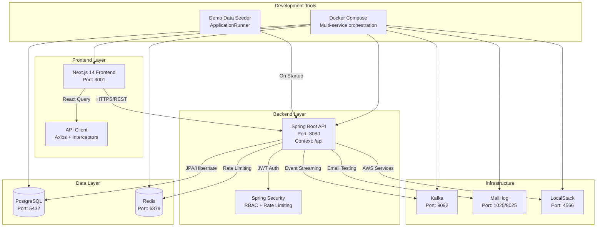
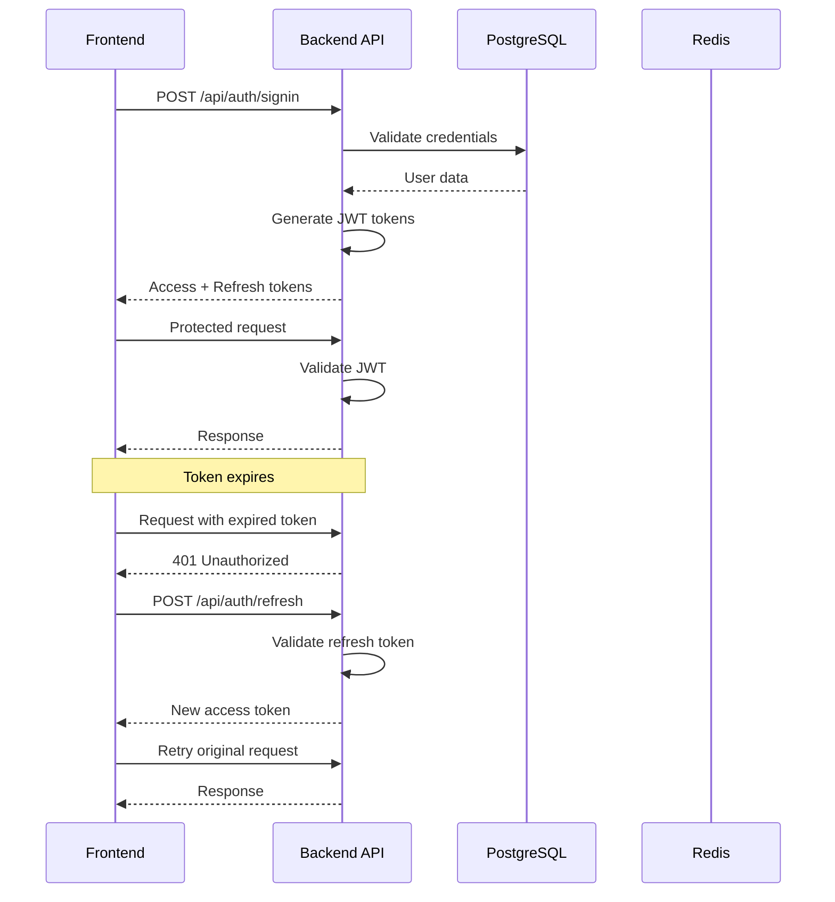
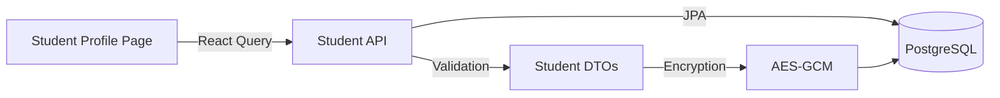
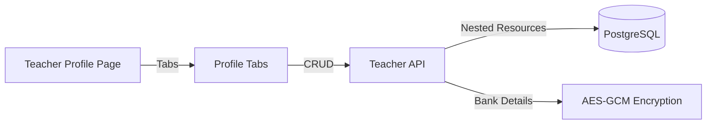

# Stage-1 System Overview

## 🏗️ **HIGH-LEVEL ARCHITECTURE**



## 🔧 **SERVICE PORTS & HEALTH ENDPOINTS**

| Service | Port | Health Endpoint | Start Command |
|---------|------|------------------|---------------|
| **Frontend** | 3001 | `http://localhost:3001` | `make fe-dev` |
| **Backend API** | 8080 | `http://localhost:8080/api/health` | `make dev-up` |
| **PostgreSQL** | 5432 | `http://localhost:5432` | `make dev-up` |
| **Redis** | 6379 | `redis-cli ping` | `make dev-up` |
| **Kafka** | 9092 | `http://localhost:9092` | `make dev-up` |
| **MailHog** | 1025/8025 | `http://localhost:8025` | `make dev-up` |
| **LocalStack** | 4566 | `http://localhost:4566` | `make dev-up` |

## 🌍 **ENVIRONMENTS & FLAGS**

| Environment | DEMO_SEED_ON_START | DEMO_ENV | DEMO_FORCE | Description |
|-------------|-------------------|----------|------------|-------------|
| **DEV** | `true` | `local` | `false` | Local development with demo data |
| **DEMO** | `true` | `demo` | `false` | Demo environment with seeded data |
| **PROD** | `false` | `prod` | `false` | Production (no demo data) |
| **PROD-FORCE** | `true` | `prod` | `true` | Production with forced demo data |

### **Environment Variables**
```bash
# Demo Data Seeding
DEMO_SEED_ON_START=true          # Enable seeding on startup
DEMO_ENV=local                   # Environment type (local|demo|prod)
DEMO_FORCE=false                 # Force seeding in production

# Database
DB_HOST=localhost
DB_PORT=5432
DB_NAME=ankurshala
DB_USERNAME=ankurshala
DB_PASSWORD=ankurshala

# Redis
REDIS_HOST=localhost
REDIS_PORT=6379

# JWT
JWT_SECRET=your-secret-key
JWT_ACCESS_EXPIRATION=900000     # 15 minutes
JWT_REFRESH_EXPIRATION=604800000 # 7 days

# Encryption
BANK_ENC_KEY=your-encryption-key # AES-GCM key for bank details
```

## 🔐 **SECURITY ARCHITECTURE**

### **Authentication Flow**


### **Rate Limiting**
- **Signin**: 5 requests/minute per IP
- **Signup**: 3 requests/hour per IP
- **General API**: 100 requests/minute per IP
- **Storage**: Redis with sliding window algorithm

## 📊 **DATA FLOW**

### **Student Profile Management**


### **Teacher Profile Management**


## 🚀 **STARTUP SEQUENCE**

### **Development Environment**
```bash
# 1. Start infrastructure services
make dev-up

# 2. Seed demo data
make seed-dev

# 3. Start frontend (new terminal)
make fe-dev

# 4. Run E2E tests
cd frontend && npm run test:e2e
```

### **Production Environment**
```bash
# 1. Start production services
docker-compose -f docker-compose.prod.yml up -d

# 2. Run migrations
make migrate-prod

# 3. Seed production data (if needed)
DEMO_FORCE=true make seed-prod
```

## 📈 **MONITORING & OBSERVABILITY**

### **Health Checks**
- **Backend**: `GET /api/health` - Returns service status
- **Database**: Connection pool status
- **Redis**: Cache hit/miss ratios
- **Frontend**: Build status and bundle analysis

### **Logging**
- **Backend**: Structured JSON logs with correlation IDs
- **Frontend**: Console logs with error boundaries
- **Docker**: Container logs with timestamps

## 🔄 **WHERE TO START FOR STAGE-2**

Based on the current Stage-1 implementation, here are the recommended starting points for Stage-2:

### **📚 Documentation References**
- [API Catalog](./api-index.md) - Complete endpoint reference
- [Database Schema](./db-schema.md) - Entity relationships and constraints
- [Security & RBAC](./security-rbac.md) - Authentication and authorization
- [Frontend Map](./frontend-map.md) - Component structure and routing
- [Testing Coverage](./tests-e2e-index.md) - E2E test matrix
- [Demo Seeding](./demo-seed.md) - Development data setup
- [Operations](./ops.md) - Deployment and troubleshooting

### **🎯 Stage-2 Recommended Features**
1. **Real-time Booking System** - Extend teacher availability with booking slots
2. **Calendar Integration** - Add calendar views and scheduling
3. **Video Session Management** - Integrate video conferencing
4. **Notification System** - Real-time notifications via WebSocket
5. **Payment Integration** - Extend bank details with payment processing
6. **Advanced Matching** - Student-teacher matching algorithms

### **🔧 Technical Foundation**
- **WebSocket Support**: Extend current REST API with real-time capabilities
- **Event Streaming**: Leverage existing Kafka infrastructure
- **Caching Strategy**: Extend Redis usage for session management
- **File Storage**: Integrate with LocalStack S3 for document storage
- **Email Notifications**: Extend MailHog integration for user notifications

### **📋 Implementation Checklist**
- [ ] Review current API endpoints and identify extensions needed
- [ ] Analyze database schema for new entity requirements
- [ ] Plan WebSocket integration with existing authentication
- [ ] Design real-time notification architecture
- [ ] Plan video session management integration
- [ ] Design payment processing workflow
- [ ] Plan advanced matching algorithms
- [ ] Design calendar and scheduling UI components
